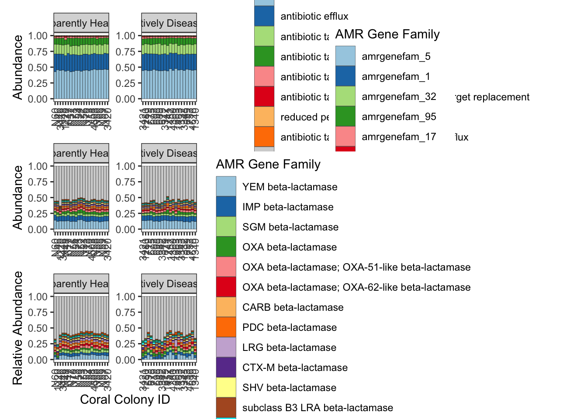
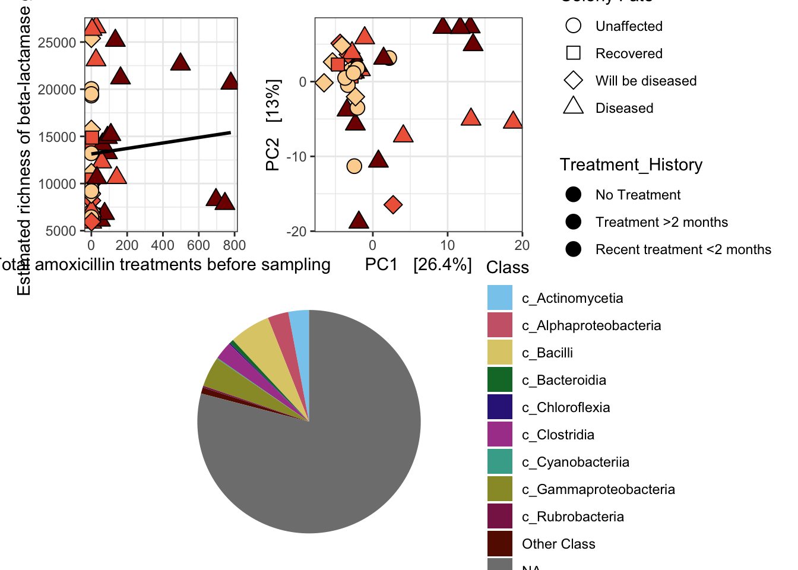

# Setup
## Install necessary packages


``` r
# For data wrangling
library(dplyr)
library(tidyr)
library(readxl)
library(stringr)
library(KEGGREST)
library(speedyseq)

# For visualization and statistical tests
library(phyloseq)
library(randomcoloR)
library(ggplot2)
theme_set(theme_bw())
library(ComplexHeatmap)
library(circlize)  # For color scaling
library(vegan)
library(cowplot)
library(microViz)
library(patchwork) # for arranging groups of plots
library(breakaway)
library(RColorBrewer)
```

# Read in data

## Load raw data 

First read in the RGI data table. Note, the table that came from the RGI program was kinda tough in the first column. So I changed the first column to have just the contig/gene ID, then got rid of the empty columns (Contig, start, stop, orientation). I also got rid of teh SNPs column and predicted_DNA columns. I also just tried saving it as an Excel document to see if it works better. 

``` r
amr <- read_excel("../data/FLK_prok_coassembly_RGI_AMR.xlsx")

# Make a short ID that corresponds to the AMR gene family name 
amr.fam <- data.frame("AMR_Gene_Family" = unique(amr$AMR_Gene_Family))
amr.fam$AMR_Gene_Family_ID <- paste0("amrgenefam_", seq_len(nrow(amr.fam)))

amr.new <- amr %>%
  left_join(amr.fam, by = "AMR_Gene_Family")

table(amr.new$AMR_Gene_Family_ID == "NA")
```

```
## 
##  FALSE 
## 200100
```

Need to read in the count, taxonomy, and metadata data for each gene. 

``` r
# Load table with count abundances from salmon ("numreads")
prokreads <- read.table("../data/FLK_OFAV_MG_prok_coassembly_salmon_quant_all_NumReads.tsv", header = TRUE, sep = "\t", row.names = 2)
prokreads <- prokreads[, -1] # get rid of the first column cause it is just numbered lines

# Load metadata
metadata <- as.data.frame(read_excel("../data/FLK_OFAV_MG_prok_coassembly_metadata_RRC_v10.xlsx", na = "NA"))
rownames(metadata) <- metadata$CoralID

# how many genes are zero across all samples? Like 32k
table(rowSums(prokreads) == 0)
```

```
## 
##  FALSE   TRUE 
## 247254  32686
```

``` r
# remove them
prokreads_nozero <- prokreads[rowSums(prokreads) != 0, ]
dim(prokreads_nozero)
```

```
## [1] 247254     41
```

``` r
# any samples with no reads? No.
table(colSums(prokreads_nozero) == 0)
```

```
## 
## FALSE 
##    41
```

``` r
# Fix the sample names bc R doesn't like column names that start with a number
colnames(prokreads_nozero) <- str_replace_all(colnames(prokreads_nozero), pattern = "[X]", "")
colnames(prokreads_nozero) <- str_split_i(colnames(prokreads_nozero), "[_]", 1)

# Read in the taxonomy
prok_taxa <- read.table("../data/FLK_OFAV_MG_prok_coassembly_tax_mmseqs2.tsv", header = FALSE, col.names = c("contig", "ncbi_taxid", "rank", "annotation", "complete_classification"), na.strings = "", sep = "\t")

## Subset the metadata
idx <- match(colnames(prokreads_nozero), rownames(metadata))
metadata_prok <- metadata[idx,] # subset the metadata to only the sequenced samples
```

Generate some summary statistics regarding the different AMR categories of all 200,000 hits

``` r
amr %>% 
  dplyr::count(Model_type)
```

```
## # A tibble: 3 × 2
##   Model_type                        n
##   <chr>                         <int>
## 1 protein homolog model        196773
## 2 protein overexpression model   1976
## 3 protein variant model          1351
```

``` r
amr %>% 
  dplyr::count(Cut_Off)
```

```
## # A tibble: 2 × 2
##   Cut_Off      n
##   <chr>    <int>
## 1 Loose   200051
## 2 Strict      49
```

``` r
x <- amr %>% 
  dplyr::count(Resistance_Mechanism) 

amr %>% 
  dplyr::count(Drug_Class)
```

```
## # A tibble: 157 × 2
##    Drug_Class                                                                  n
##    <chr>                                                                   <int>
##  1 aminocoumarin antibiotic                                                 1380
##  2 aminoglycoside antibiotic                                               17596
##  3 aminoglycoside antibiotic; aminocoumarin antibiotic                       670
##  4 aminoglycoside antibiotic; cephalosporin; cephamycin; penam              1114
##  5 aminoglycoside antibiotic; polyamine antibiotic; isoniazid-like antibi…     1
##  6 aminoglycoside antibiotic; tetracycline antibiotic; diaminopyrimidine …   113
##  7 aminoglycoside antibiotic; tetracycline antibiotic; phenicol antibiotic    73
##  8 antibacterial free fatty acids                                            388
##  9 bicyclomycin-like antibiotic                                              159
## 10 carbapenem                                                              10073
## # ℹ 147 more rows
```

``` r
amr %>% 
  dplyr::count(AMR_Gene_Family)
```

```
## # A tibble: 438 × 2
##    AMR_Gene_Family                        n
##    <chr>                              <int>
##  1 16S rRNA methyltransferase (A1408)   186
##  2 16S rRNA methyltransferase (G1405)  1249
##  3 AAC(2')                              831
##  4 AAC(3)                              1918
##  5 AAC(6')                             3005
##  6 AAC(6'); AAC(6')-Ib-cr                90
##  7 AAK beta-lactamase                    52
##  8 ACC beta-lactamase                   350
##  9 ACI beta-lactamase                   137
## 10 ACT beta-lactamase                   828
## # ℹ 428 more rows
```

``` r
# How many unique genes had AMR "hits"

amr$ORF_ID %>% unique %>% length
```

```
## [1] 200100
```


# Figure S7 code

## Fig S7a - Resistance mechanism

A whopping 129,772 AMR genes don't have a taxonomic ID. I will remove those to get a better look at what taxa are making up the classified AMR genes. 


``` r
amr.ps <- amr %>% 
  dplyr::select(ORF_ID, Cut_Off, Best_Hit_ARO, Drug_Class, Resistance_Mechanism, AMR_Gene_Family) %>%
  as.matrix

#amr.ps %>% head

amr.tax <- amr %>% 
  left_join(prok_taxa, by = c("ORF_ID" = "contig")) %>%
  dplyr::select(ORF_ID, Cut_Off, Best_Hit_ARO, Drug_Class, Resistance_Mechanism, AMR_Gene_Family, annotation, complete_classification) %>%
  separate(complete_classification, 
           into = c("Domain", "Phylum", "Class", "Order", "Family", "Genus", "Species"), 
           sep = "[;]", remove = TRUE) %>%
  as.matrix
```

```
## Warning: Expected 7 pieces. Missing pieces filled with `NA` in 16870 rows [29, 39, 40,
## 60, 94, 95, 136, 141, 148, 149, 206, 207, 219, 221, 224, 256, 272, 290, 291,
## 292, ...].
```

``` r
rownames(amr.ps) <- amr.ps[,1]
rownames(amr.tax) <- amr.tax[,1]

prokreads_nozero$Genes <- NULL

NUMREADS = otu_table(prokreads_nozero, taxa_are_rows = TRUE)
META = sample_data(metadata_prok)
AMR = tax_table(amr.tax)

ps.amr <- phyloseq(NUMREADS, META, AMR)
```


``` r
ps.amr.taxfix <- ps.amr %>%
  transmute_tax_table(Resistance_Mechanism, AMR_Gene_Family, Best_Hit_ARO, ORF_ID) %>%
  tax_fix()

sample_data(ps.amr.taxfix)$Condition_At_Sampling <- factor(sample_data(ps.amr.taxfix)$Condition_At_Sampling, levels = c("Apparently Healthy", "Actively Diseased"))

rest.mech <- ps.amr.taxfix %>%
  comp_barplot(tax_level = "Resistance_Mechanism", 
               other_name = "Other resistance mechanism", # set custom name for the "other" category
               facet_by = "Condition_At_Sampling") +
  theme(axis.text.x = element_text(angle = 90, vjust = 0.5, hjust=1)) +
  labs(x = "Coral Colony ID", fill = "Resistance Mechanism")
```

```
## Registered S3 method overwritten by 'seriation':
##   method         from 
##   reorder.hclust vegan
```

``` r
#rest.mech
#tax_table(ps.amr.taxfix)[,1] %>% unique
```

## Fig S7b - ARG Gene Family


``` r
# Make a new phyloseq object with the unique AMR gene family IDs
amr.ps.new <- amr.new %>% 
  dplyr::select(AMR_Gene_Family, AMR_Gene_Family_ID, ORF_ID) %>%
  as.matrix
#Resistance_Mechanism, AMR_Gene_Family, 
amr.ps.new %>% head

rownames(amr.ps.new) <- amr.ps.new[,3]

prokreads_nozero$Genes <- NULL

NUMREADS = otu_table(prokreads_nozero, taxa_are_rows = TRUE)
META = sample_data(metadata_prok)
AMR = tax_table(amr.ps.new)

ps.amr.new <- phyloseq(NUMREADS, META, AMR)
ps.amr.new

# Agglomerate by the gene family
ps.genefam <- ps.amr.new %>%
  tax_glom(taxrank = "AMR_Gene_Family_ID") %>% 
  tax_fix()

ps.genefam

sample_data(ps.genefam)$Condition_At_Sampling <- factor(sample_data(ps.genefam)$Condition_At_Sampling,
                                                        levels = c("Apparently Healthy", "Actively Diseased"))

# Visualize the amr gene families, using the ID, since it is shorter. I can match up the actual name later
genefam <- ps.genefam %>%
  comp_barplot(tax_level = "AMR_Gene_Family_ID", 
               other_name = "Other Gene Family", # set custom name for the "other" category
               facet_by = "Condition_At_Sampling", 
               n_taxa = 15,
               merge_other = TRUE) +
  theme(axis.text.x = element_text(angle = 90, vjust = 0.5, hjust=1)) +
  labs(x = "Coral Colony ID", fill = "AMR Gene Family")
#genefam

amrfamilymatches <- filter(as.data.frame(amr.ps.new), AMR_Gene_Family_ID %in% c("amrgenefam_5", 
                                                            "amrgenefam_1",
                                                            "amrgenefam_32",
                                                            "amrgenefam_95",
                                                            "amrgenefam_17",
                                                            "amrgenefam_58",
                                                            "amrgenefam_6",
                                                            "amrgenefam_197",
                                                            "amrgenefam_88",
                                                            "amrgenefam_163",
                                                            "amrgenefam_101",
                                                            "amrgenefam_77",
                                                            "amrgenefam_62",
                                                            "amrgenefam_87",
                                                            "amrgenefam_74"
                                                            ))
# Get unique combinations of col1 and col2
unique_combinations <- unique(amrfamilymatches[c("AMR_Gene_Family", "AMR_Gene_Family_ID")])
print(unique_combinations)

# How many gene families are there? 437
tax_table(ps.genefam)[,1] %>% unique

# What proportion is the top 15 families?
genefam_sums <- taxa_sums(ps.genefam)
top15_genefams <- names(sort(genefam_sums, decreasing = TRUE))[1:15]
genefams_relabund <- transform_sample_counts(ps.genefam, function(x) x / sum(x))
# Subset to just those top taxa
genefams_top15_ps <- prune_taxa(top15_genefams, genefams_relabund)

# Sum their total relative abundance across all samples
top15_genefams_total_rel_abund <- sum(taxa_sums(genefams_top15_ps)) / sum(taxa_sums(genefams_relabund))
top15_genefams_total_rel_abund

# Sample-specific relative abundances
sample_sums_top15_genefams <- sample_sums(prune_taxa(top15_genefams, genefams_relabund))
sample_sums_total_genefams <- sample_sums(genefams_relabund)
rel_abund_per_sample_genefams <- sample_sums_top15_genefams / sample_sums_total_genefams

summary(rel_abund_per_sample_genefams)
```


## Fig S7c - Beta-lactamases


``` r
amr.new$AMR_Gene_Family %>% head
```

```
## [1] "major facilitator superfamily (MFS) antibiotic efflux pump"      
## [2] "lipid A phosphatase"                                             
## [3] "GOB beta-lactamase"                                              
## [4] "chloramphenicol acetyltransferase (CAT)"                         
## [5] "resistance-nodulation-cell division (RND) antibiotic efflux pump"
## [6] "MCR phosphoethanolamine transferase"
```

``` r
betalactamases <- amr.new[grep("beta-lactamase", amr.new$AMR_Gene_Family), ]

betalactamases$AMR_Gene_Family %>% unique %>% length
```

```
## [1] 253
```

``` r
dim(betalactamases)
```

```
## [1] 53467    17
```
In addition, I want to make a stacked bar plot of only the beta-lactamase genes. What are the different types that are most abundant in the dataset?

``` r
# Make a new phyloseq object with the unique AMR gene family IDs
bl.new <- betalactamases %>% 
  dplyr::select(AMR_Gene_Family, AMR_Gene_Family_ID, ORF_ID) %>%
  as.matrix
#Resistance_Mechanism, AMR_Gene_Family, 
#bl.new %>% head

# How many total gene families and total beta lactamases
bl.new[,1] %>% unique %>% length
```

```
## [1] 253
```

``` r
bl.new %>% dim()
```

```
## [1] 53467     3
```

``` r
rownames(bl.new) <- bl.new[,3]

prokreads_nozero$Genes <- NULL

NUMREADS = otu_table(prokreads_nozero, taxa_are_rows = TRUE)
META = sample_data(metadata_prok)
AMR = tax_table(bl.new)

bl.psobj <- phyloseq(NUMREADS, META, AMR)

# 47,892 beta-lactamase genes with positive abundance

# Agglomerate by the gene family #253 taxa
bl.psobj.agg <- bl.psobj %>%
  tax_glom(taxrank = "AMR_Gene_Family") %>% # Not sure how it gets to 441 when there are 437 unique taxa
  tax_fix()


sample_data(bl.psobj.agg)$Condition_At_Sampling <- factor(sample_data(bl.psobj.agg)$Condition_At_Sampling,
                                                        levels = c("Apparently Healthy", "Actively Diseased"))

# Visualize the amr gene families, using the ID, since it is shorter. I can match up the actual name later
blactams <- bl.psobj.agg %>%
  comp_barplot(tax_level = "AMR_Gene_Family", 
               other_name = "Other beta-Lactamase gene family", # set custom name for the "other" category
               facet_by = "Condition_At_Sampling", 
               n_taxa = 15,
               merge_other = TRUE) +
  labs(x = "Coral Colony ID", y = "Relative Abundance", fill = "AMR Gene Family") +
  theme(axis.text.x = element_text(angle = 90, vjust = 0.5, hjust=1))

#blactams

# What proportion is the top 15 families?
bl_sums <- taxa_sums(bl.psobj.agg)
top15_bl <- names(sort(bl_sums, decreasing = TRUE))[1:15]
bl_relabund <- transform_sample_counts(bl.psobj.agg, function(x) x / sum(x))
# Subset to just those top taxa
bl_top15_ps <- prune_taxa(top15_bl, bl_relabund)

# Sum their total relative abundance across all samples
top15_bl_total_rel_abund <- sum(taxa_sums(bl_top15_ps)) / sum(taxa_sums(bl_relabund))
top15_bl_total_rel_abund
```

```
## [1] 0.3928754
```

``` r
# Sample-specific relative abundances
sample_sums_top15_bl <- sample_sums(prune_taxa(top15_bl, bl_relabund))
sample_sums_total_bl <- sample_sums(bl_relabund)
rel_abund_per_sample_bl <- sample_sums_top15_bl / sample_sums_total_bl

summary(rel_abund_per_sample_bl)
```

```
##    Min. 1st Qu.  Median    Mean 3rd Qu.    Max. 
##  0.2398  0.3657  0.4091  0.3929  0.4328  0.4614
```

# Figure S7

The coral “resistome” included approximately 200,000 potential antibiotic resistance genes (ARGs) across all coral samples, including over 50,000 beta-lactamase genes. a) The ARGs fell into a variety of resistance mechanisms. The top eight resistance mechanisms are shown, and “Other resistance mechanism” includes five different mechanisms or a combination of mechanisms. b) Diverse ARG families make up the coral resistome. The top 15 most common gene families are displayed. The “Other Gene Family” category includes the remaining 422 different gene families. c) The relative abundance of the top 15 most abundant beta-lactamase genes make up less than 46% of all beta-lactamase genes. The remaining “Other beta-Lactamase gene family” category includes 238 families. 


``` r
wrap_plots(rest.mech, genefam, blactams, nrow = 3, axis_titles = "collect_x")
```



``` r
#ggsave("../figures/AMR_all_betalactams_stacked_bar_08.07.25.pdf", width = 12, height = 15)
```

There are 53,467 genes that are classified as beta-lactamases in the dataset. This includes 253 unique types. 

# Figure 5 code

## Figure 5a

Examine the hypothesis that as amoxicillin treatment increases, there is an increasing diversity of beta-lactamase genes. 

Use breakaway to test the richness estimation and covariates

``` r
# Change levels
sample_data(bl.psobj)$Condition_At_Sampling <- factor(sample_data(bl.psobj)$Condition_At_Sampling, levels = c("Apparently Healthy", "Actively Diseased"))

sample_data(bl.psobj)$Fate_after_SP1 <- factor(sample_data(bl.psobj)$Fate_after_SP1, levels = c("Unaffected", "Recovered", "Will be diseased", "Diseased"))

sample_data(bl.psobj)$Treatment_History <- factor(sample_data(bl.psobj)$Treatment_History, levels = c("No Treatment", "Treatment >2 months", "Recent treatment <2 months"))

richness_bl.og <- bl.psobj %>% breakaway

# statistical inference
meta.bl <- bl.psobj %>%
  sample_data %>%
  as_tibble %>%
  mutate("sample_names" = bl.psobj %>% sample_names )

combined_richness.bl <- meta.bl %>%
  left_join(summary(richness_bl.og),
            by = "sample_names") %>%
  mutate(Condition_At_Sampling = 
           factor(Condition_At_Sampling,
                  levels=c("Apparently Healthy", "Actively Diseased"))) %>%
  mutate(Treatment_History = 
           factor(Treatment_History,
                  levels=c("No Treatment", "Treatment >2 months", "Recent treatment <2 months"))) %>%
  mutate(Fate_after_SP1 = 
           factor(Fate_after_SP1,
                  levels=c("Unaffected", "Recovered", "Will be diseased", "Diseased")))

# Test for an impact of disease on richness
bt_disease_fixed <- betta(formula = estimate ~ Fate_after_SP1, 
                      ses = error, data = combined_richness.bl)
bt_disease_fixed$table
```

```
##                                Estimates Standard Errors p-values
## (Intercept)                    12993.014        1052.548    0.000
## Fate_after_SP1Recovered        -1550.471        3331.511    0.642
## Fate_after_SP1Will be diseased -1720.880        2223.975    0.439
## Fate_after_SP1Diseased          1929.916        1522.046    0.205
```

``` r
# Test for an impact of treatments on richness - scaled by size
bt_treatments_fixed <- betta(formula = estimate ~ Estimated_Num_treatments_Per_sq_m, 
                      ses = error, data = combined_richness.bl)
bt_treatments_fixed$table
```

```
##                                     Estimates Standard Errors p-values
## (Intercept)                       12810.69818       1052.5485    0.000
## Estimated_Num_treatments_Per_sq_m    12.66189         35.0515    0.718
```

``` r
# Test for an impact of treatments on richness
bt_treatments_fixed <- betta(formula = estimate ~ Number_treatments_PreSampling, 
                      ses = error, data = combined_richness.bl)
bt_treatments_fixed$table
```

```
##                                  Estimates Standard Errors p-values
## (Intercept)                   12687.433561     1052.548456     0.00
## Number_treatments_PreSampling     3.079189        4.677442     0.51
```

``` r
# Test for an impact of treatment history (recent = <2 months, versus a while ago)
bt_treatments_fixed <- betta(formula = estimate ~ Treatment_History, 
                      ses = error, data = combined_richness.bl)
bt_treatments_fixed$table
```

```
##                                               Estimates Standard Errors
## (Intercept)                                 12944.41816        1052.548
## Treatment_HistoryTreatment >2 months           39.11397        1830.025
## Treatment_HistoryRecent treatment <2 months  1411.79509        1841.125
##                                             p-values
## (Intercept)                                    0.000
## Treatment_HistoryTreatment >2 months           0.983
## Treatment_HistoryRecent treatment <2 months    0.443
```

``` r
# Plot estimated richness 
richness <- ggplot(combined_richness.bl, aes(x = Number_treatments_PreSampling, y = estimate)) +
  geom_point(size = 4, aes(fill = Treatment_History,
                           shape = Fate_after_SP1)) +
  geom_smooth(method = "lm", se = FALSE, color = "black") +
  labs(x = "Total amoxicillin treatments before sampling", y = "Estimated richness of beta-lactamase genes", fill = "Treatment_History", shape = "Colony Fate") +
  scale_shape_manual(values = c(21, 22, 23, 24)) +
  scale_fill_manual(values = c("#FDD49E", "#EF6548", "#7F0000"))
#richness

#ggsave("../figures/AMR_beta-lactamase_10.16.25.pdf")

# Plot estimated richness for only the recently treated corals
# Filter for only the recently treated corals
combined_richness.bl.recenttreat <- combined_richness.bl %>%
  filter(Treatment_History == "Recent treatment <2 months")

# Test for an impact of treatments on richness
bt_treatments_fixed <- betta(formula = estimate ~ Number_treatments_PreSampling, 
                      ses = error, data = combined_richness.bl.recenttreat)
bt_treatments_fixed$table
```

```
##                                  Estimates Standard Errors p-values
## (Intercept)                   1.396703e+04     1825.330865    0.000
## Number_treatments_PreSampling 7.839404e-01        4.663141    0.866
```

``` r
# Test for an impact of treatments on richness - scaled by size
bt_treatments_fixed <- betta(formula = estimate ~ Estimated_Num_treatments_Per_sq_m, 
                      ses = error, data = combined_richness.bl)
bt_treatments_fixed$table
```

```
##                                     Estimates Standard Errors p-values
## (Intercept)                       12810.69818       1052.5485    0.000
## Estimated_Num_treatments_Per_sq_m    12.66189         35.0515    0.718
```

``` r
#plot - negative results there too
# ggplot(combined_richness.bl.recenttreat, aes(x = Total_treatments_before_coring, y = estimate)) +
#   geom_point(size = 4, aes(fill = Treatment_History,
#                            shape = Fate_after_SP1)) +
#   geom_smooth(method = "lm", se = FALSE, color = "black") +
#   labs(x = "Total amoxicillin treatments before sampling", y = "Estimated richness of beta-lactamase genes", fill = "Treatment_History", shape = "Colony Fate") +
#   scale_shape_manual(values = c(24)) +
#   scale_fill_manual(values = c("#7F0000"))
```
## Fig 5c

``` r
bl.tax <- betalactamases %>% 
  left_join(prok_taxa, by = c("ORF_ID" = "contig")) %>%
  dplyr::select(ORF_ID, Cut_Off, Best_Hit_ARO, Drug_Class, Resistance_Mechanism, AMR_Gene_Family, annotation, complete_classification) %>%
  separate(complete_classification, 
           into = c("Domain", "Phylum", "Class", "Order", "Family", "Genus", "Species"), 
           sep = "[;]", remove = TRUE) %>%
  as.data.frame()
```

```
## Warning: Expected 7 pieces. Missing pieces filled with `NA` in 4205 rows [18, 29, 31,
## 52, 53, 54, 76, 124, 125, 142, 153, 156, 159, 162, 198, 214, 225, 234, 246,
## 250, ...].
```

``` r
#write.table(bl.tax, "../data/beta-lactamase_AMR.txt", sep="\t", row.names = FALSE, col.names = TRUE)

bl.tax %>% head
rownames(bl.tax) <- bl.tax[,1]

# How many fully unclassified taxa?
bl.tax %>%
  dplyr::count(annotation) %>%
  arrange(desc(n))

classonly <- bl.tax %>%
  dplyr::count(Class) %>%
  arrange(desc(n))

phylaonly <- bl.tax %>%
  dplyr::count(Phylum) %>%
  arrange(desc(n))

# Only show the top 10 most abundant Phyla Aggregate all others into "others
plotting_phyla <- phylaonly %>% 
  mutate(rank = rank(-n), 
         Phylum = ifelse(rank <= 10, Phylum, 'Other Phyla'))

# Class level pie chart
plotting_class <- classonly %>%
  mutate(rank = rank(-n),
         Class = ifelse(rank <= 10, Class, 'Other Class')) %>%
  group_by(Class) %>%
  summarise(new_n = sum(n))

safe_colorblind_palette <- c("#88CCEE", "#CC6677", "#DDCC77", "#117733", "#332288", "#AA4499", 
                             "#44AA99", "#999933", "#882255", "#661100", "#6699CC", "#888888")

betalactam.tax <- ggplot(plotting_class, aes(x = "", y = new_n, fill = Class)) +
  geom_bar(stat = "identity", width = 1) +
  coord_polar("y", start = 0) +
  theme_void() +
  labs(fill = "Class") +
  scale_fill_manual(values = safe_colorblind_palette)

#betalactam.tax
```

## Figure 5b


``` r
NUMREADS = otu_table(prokreads_nozero, taxa_are_rows = TRUE)
META = sample_data(metadata_prok)
AMR = tax_table(as.matrix(bl.tax))

ps.amr.bl <- phyloseq(NUMREADS, META, AMR)
ps.amr.bl
```

```
## phyloseq-class experiment-level object
## otu_table()   OTU Table:          [ 47892 taxa and 41 samples ]:
## sample_data() Sample Data:        [ 41 samples by 40 sample variables ]:
## tax_table()   Taxonomy Table:     [ 47892 taxa by 14 taxonomic ranks ]:
## taxa are rows
```
Prep data for the plot

``` r
# transform the data using centered log-ratio transformations
ps.amr.bl_clr <- microbiome::transform(ps.amr.bl, 'clr')

# Generate aitchison distance ordination (euclidean distance on clr-transformed data)
ps.amr.bl_clr_euc <- ordinate(ps.amr.bl_clr, "RDA", "euclidean")

# Generate aitchison distance dissimilarity matrix with vegan for adonis2 test
ps.amr.bl.clr_meta <- as(sample_data(ps.amr.bl_clr), "data.frame")
ps.amr.bl.clr_otu <- otu_table(ps.amr.bl_clr) %>% as.matrix %>% t() #samples must be rows, so transpose

#get dissimilarity matrix 
ps.amr.bl.euc_diss <- vegdist(ps.amr.bl.clr_otu, method = "euclidean")
```


### Treatment stat tests

I am interested in how the number of treatments in different colonies varies and is potentially influencing the number of beta-lactamase genes, which would confer resistance on colonies. 
Some important variables:
- Recent_Treatment_Less_than_two_months (was the treatment recent? In some cases, corals never had treatments.)
- Estimated_Num_treatments_Per_sq_m (scaled to size, which makes the treatments a bit more comparable across colonies)
- Number_treatments_PreSampling (treatments leading up to the sampling in May/June 2021)
- Colony fate = what did the colony end up doing (potentially related to treatments)

``` r
metadata_prok$Fate_after_SP1 <- factor(metadata_prok$Fate_after_SP1, levels = c("Unaffected", "Recovered", "Will be diseased", "Diseased"))

sample_data(ps.amr.bl_clr)$Treatment_History <- factor(sample_data(ps.amr.bl_clr)$Treatment_History, levels = c("No Treatment", "Treatment >2 months", "Recent treatment <2 months"))

sample_data(ps.amr.bl_clr)$Fate_after_SP1 <- factor(sample_data(ps.amr.bl_clr)$Fate_after_SP1, levels = c("Unaffected", "Recovered", "Will be diseased", "Diseased"))

amr_pca <- plot_ordination(ps.amr.bl_clr, ps.amr.bl_clr_euc, type="samples", 
                shape ="Fate_after_SP1") +
  coord_fixed()

amr_pca$layers
```

```
## [[1]]
## geom_point: na.rm = TRUE
## stat_identity: na.rm = TRUE
## position_identity
```

``` r
amr_pca$layers <- amr_pca$layers[-1]

amr_pca_final <- amr_pca +
  geom_point(size = 4, aes(fill = Treatment_History)) +
  labs(color = "Treatment History", shape = "Colony Fate")+
  scale_shape_manual(values = c(21, 22, 23, 24)) +
  scale_fill_manual(values = c("#FDD49E", "#EF6548", "#7F0000"))

#amr_pca_final
#ggsave("../figures/AMR_beta-lactamase_PCA_10.16.25.pdf")

# PERMANOVA for amoxicillin treatments
set.seed(10)
adonis2(formula = ps.amr.bl.euc_diss ~ Estimated_Num_treatments_Per_sq_m, data = ps.amr.bl.clr_meta, permutations = 999) 
```

```
## Permutation test for adonis under reduced model
## Permutation: free
## Number of permutations: 999
## 
## adonis2(formula = ps.amr.bl.euc_diss ~ Estimated_Num_treatments_Per_sq_m, data = ps.amr.bl.clr_meta, permutations = 999)
##          Df SumOfSqs      R2      F Pr(>F)
## Model     1    53889 0.02598 1.0403  0.354
## Residual 39  2020336 0.97402              
## Total    40  2074226 1.00000
```

``` r
set.seed(10)
adonis2(formula = ps.amr.bl.euc_diss ~ Number_treatments_PreSampling, data = ps.amr.bl.clr_meta, permutations = 999) 
```

```
## Permutation test for adonis under reduced model
## Permutation: free
## Number of permutations: 999
## 
## adonis2(formula = ps.amr.bl.euc_diss ~ Number_treatments_PreSampling, data = ps.amr.bl.clr_meta, permutations = 999)
##          Df SumOfSqs      R2      F Pr(>F)
## Model     1    37378 0.01802 0.7157  0.771
## Residual 39  2036847 0.98198              
## Total    40  2074226 1.00000
```

``` r
set.seed(10)
adonis2(formula = ps.amr.bl.euc_diss ~ Treatment_History, data = ps.amr.bl.clr_meta, permutations = 999) 
```

```
## Permutation test for adonis under reduced model
## Permutation: free
## Number of permutations: 999
## 
## adonis2(formula = ps.amr.bl.euc_diss ~ Treatment_History, data = ps.amr.bl.clr_meta, permutations = 999)
##          Df SumOfSqs      R2      F Pr(>F)
## Model     2   134507 0.06485 1.3175  0.135
## Residual 38  1939719 0.93515              
## Total    40  2074226 1.00000
```

What if I only subset corals that had any history of treatment? Remove all corals that were not treated at ALL over the course of the study?

``` r
# Subset to only corals with any treatment history
ps.amr.bl.treated <- subset_samples(ps.amr.bl, Recent_Treatment_Less_than_two_months != "NoTreatments")

# transform the data using centered log-ratio transformations
ps.amr.bl.treated_clr <- microbiome::transform(ps.amr.bl.treated, 'clr')

# Generate aitchison distance ordination (euclidean distance on clr-transformed data)
ps.amr.bl.treated_clr_euc <- ordinate(ps.amr.bl.treated_clr, "RDA", "euclidean")

# Generate aitchison distance dissimilarity matrix with vegan for adonis2 test
ps.amr.bl.treated.clr_meta <- as(sample_data(ps.amr.bl.treated_clr), "data.frame")
ps.amr.bl.treated.clr_otu <- otu_table(ps.amr.bl.treated_clr) %>% as.matrix %>% t() #samples must be rows, so transpose

#get dissimilarity matrix 
ps.amr.bl.treated.euc_diss <- vegdist(ps.amr.bl.treated.clr_otu, method = "euclidean")

sample_data(ps.amr.bl.treated_clr)$Recent_Treatment_Less_than_two_months <- factor(sample_data(ps.amr.bl.treated_clr)$Recent_Treatment_Less_than_two_months, levels = c("No", "Yes"))


# PERMANOVA for amoxicillin treatments
set.seed(10)
adonis2(formula = ps.amr.bl.treated.euc_diss ~ Estimated_Num_treatments_Per_sq_m, data = ps.amr.bl.treated.clr_meta, permutations = 999) 
```

```
## Permutation test for adonis under reduced model
## Permutation: free
## Number of permutations: 999
## 
## adonis2(formula = ps.amr.bl.treated.euc_diss ~ Estimated_Num_treatments_Per_sq_m, data = ps.amr.bl.treated.clr_meta, permutations = 999)
##          Df SumOfSqs      R2      F Pr(>F)
## Model     1    51791 0.03398 0.8794  0.527
## Residual 25  1472358 0.96602              
## Total    26  1524149 1.00000
```

``` r
set.seed(10)
adonis2(formula = ps.amr.bl.treated.euc_diss ~ Number_treatments_PreSampling, data = ps.amr.bl.treated.clr_meta, permutations = 999) 
```

```
## Permutation test for adonis under reduced model
## Permutation: free
## Number of permutations: 999
## 
## adonis2(formula = ps.amr.bl.treated.euc_diss ~ Number_treatments_PreSampling, data = ps.amr.bl.treated.clr_meta, permutations = 999)
##          Df SumOfSqs      R2      F Pr(>F)
## Model     1    46226 0.03033 0.7819  0.656
## Residual 25  1477923 0.96967              
## Total    26  1524149 1.00000
```

``` r
set.seed(10)
adonis2(formula = ps.amr.bl.treated.euc_diss ~ Recent_Treatment_Less_than_two_months, data = ps.amr.bl.treated.clr_meta, permutations = 999) 
```

```
## Permutation test for adonis under reduced model
## Permutation: free
## Number of permutations: 999
## 
## adonis2(formula = ps.amr.bl.treated.euc_diss ~ Recent_Treatment_Less_than_two_months, data = ps.amr.bl.treated.clr_meta, permutations = 999)
##          Df SumOfSqs     R2      F Pr(>F)
## Model     1    36725 0.0241 0.6173   0.88
## Residual 25  1487424 0.9759              
## Total    26  1524149 1.0000
```
Continued negative results. 


# Figure 5

Diverse beta-lactamase genes exist within the coral microbiome regardless of application of the antibiotic amoxicillin. a) The estimated richness (breakaway) of the beta-lactamase genes in each sample did not significantly increase with amoxicillin treatments or recent amoxicillin application (betta test p > 0.05 for total number of amoxicillin treatments (continuous), total number of amoxicillin treatments scaled per m2 of live tissue area (continuous), and treatment history (categorical)). The line represents a linear regression. n.s. = not significant from the betta test for heterogeneity of total diversity. b) Principal component analysis showing the beta diversity of beta-lactamase genes in the coral microbiome did not differ due to number of treatments (raw and scaled to tissue area) or recent treatment application (PERMANOVA, p > 0.05). Points in a) and b) are shaped based on the colony fate and colored based on treatment history. c) Taxonomic affiliation of the 53,467 individual beta-lactamase genes depicted as a pie chart indicated most were unclassified (NA), and a small proportion were annotated at the class taxonomic level. The top nine most abundant classes are shown, and the “Other Class” includes the remaining 94 classes. 


``` r
#ggarrange(ggarrange(ggarrange(treatments, richness, ncol = 2, common.legend = TRUE, labels = c("a.", "b."), legend = "bottom"), 
#          betalactam.tax, widths = c(1.5, 1), labels = c("", "c.")), 
#          blactams, nrow = 2, labels = c("", "d."))

wrap_plots(wrap_plots(richness, amr_pca_final, guides = "collect", widths = c(1,1.5)),
           wrap_plots(betalactam.tax), nrow = 2, heights = c(1,1.3), axis_titles = "collect")
```

```
## `geom_smooth()` using formula = 'y ~ x'
```



``` r
#ggsave("../figures/AMR_beta-lactamase_all_10.16.25.pdf", width = 12, height = 8)
```

