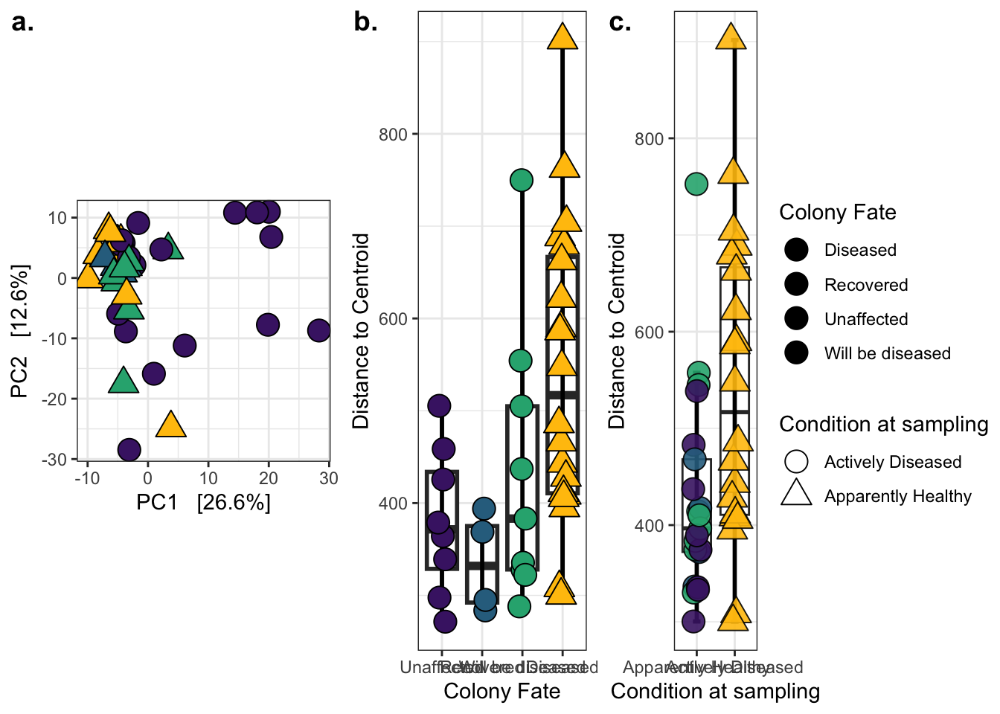
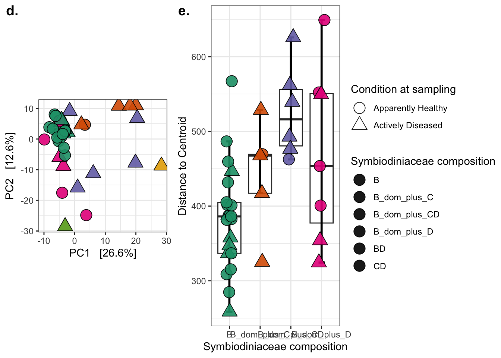
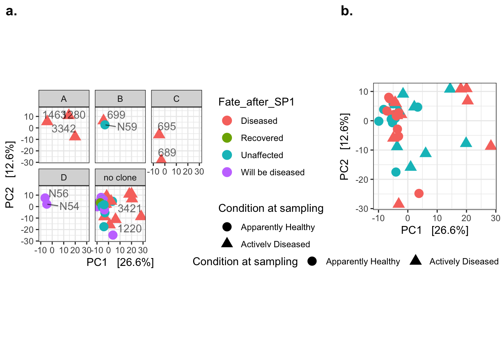
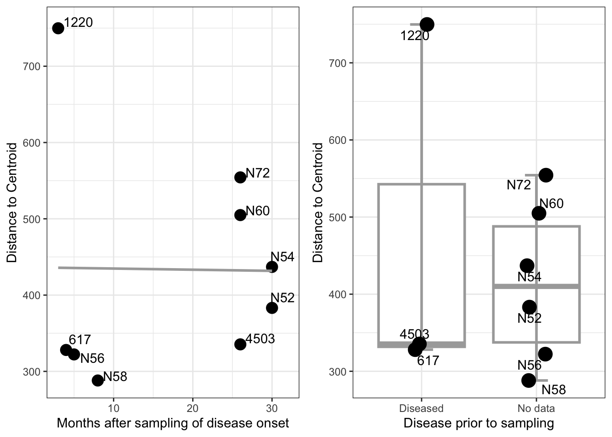
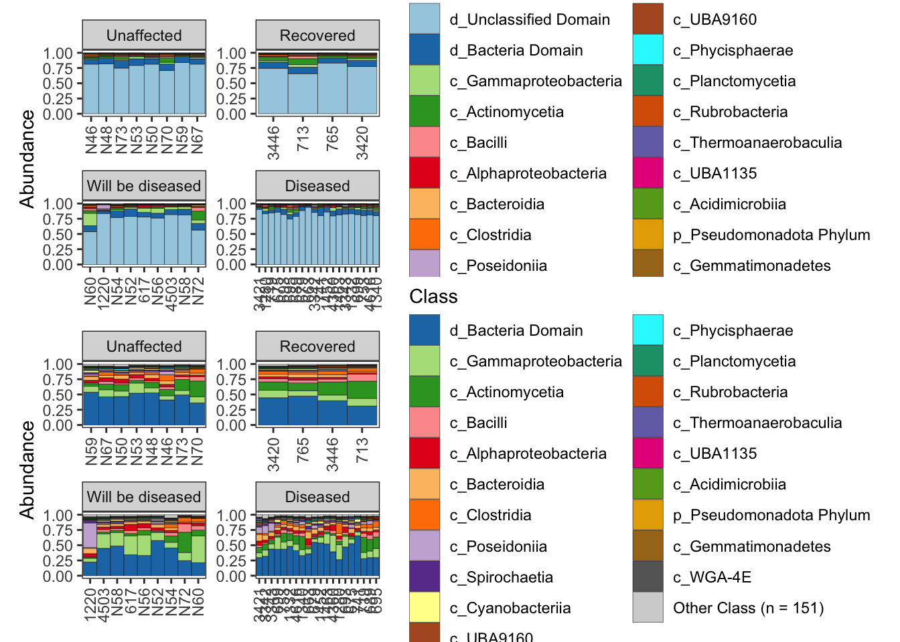

# Setup
## Install necessary packages


``` r
# For data wrangling
library(readxl)
library(stringr)
library(dplyr)
library(tidyr)

# For stats and visualization
library(phyloseq)
library(vegan)
library(microbiome)
library(ggplot2)
theme_set(theme_bw())
library(ggpubr)
library(devtools)
library(pairwiseAdonis)
library(microViz)
library(patchwork) # for arranging groups of plots
```


# MS Analysis - prokaryotic microbiome beta diversity

The data included here are abundances on all prokaryote genes in a Orbicella faveolata coral metagenome co-assembly. The prokaryote genes were identified using EukRep. EukRep split the coassembly into prok and euk fractions. I then got predicted genes from prodigal (output both AA and nucleotide seqs). I took the prok fraction of predicted genes (nucleotide) and re-mapped the eukaryote-removed reads on the prok genes to get gene abundances. All analyses here represent genes and their abundances in the prokaryotic microbiome of O. faveolata. 

## Data 

Data tables can be downloaded from Zenodo: https://doi.org/10.5281/zenodo.11493775 

``` r
# Load table with count abundances from salmon ("numreads")
prokreads <- read.table("../data/FLK_OFAV_MG_prok_coassembly_salmon_quant_all_NumReads.tsv", header = TRUE, sep = "\t", row.names = 2)
prokreads <- prokreads[, -1] # get rid of the first column cause it is just numbered lines

# Load metadata - Use updated metadata (v10 with new symbiont and treatment categories)
metadata <- as.data.frame(read_excel("../data/FLK_OFAV_MG_prok_coassembly_metadata_RRC_v10.xlsx", na = "NA"))
rownames(metadata) <- metadata$CoralID

# remove genes are zero across all samples? Like 32k 
prokreads_nozero <- prokreads[rowSums(prokreads) != 0, ]

# Fix the sample names because R doesn't like column names that start with a number
colnames(prokreads_nozero) <- str_replace_all(colnames(prokreads_nozero), pattern = "[X]", "")
colnames(prokreads_nozero) <- str_split_i(colnames(prokreads_nozero), "[_]", 1)
```

## Phyloseq object
Start with a phyloseq object jsut with the count data (no annotation information). The annotations aren't needed for the PCAs I make here.

``` r
## Make phyloseq object of count-related data 
idx <- match(colnames(prokreads_nozero), rownames(metadata))
metadata_prok <- metadata[idx,] # subset the metadata to only the sequenced Florida Keys samples, and no Orbicella franksi coral data. 

NUMREADS = otu_table(prokreads_nozero, taxa_are_rows = TRUE)
META = sample_data(metadata_prok)

ps.prok <- phyloseq(NUMREADS, META)
ps.prok
```

```
## phyloseq-class experiment-level object
## otu_table()   OTU Table:         [ 247254 taxa and 41 samples ]
## sample_data() Sample Data:       [ 41 samples by 40 sample variables ]
```

## Transform data and dissimilarity
I have a matrix of read counts in different coral samples for each gene. To account for the compositional nature of this dataset (limited sequencing output), I am going to use centered log-ratio transformation on the read counts for the analysis of these data. I will visualize everything in Aitchison distance since it is more compositionally aware and robust to subsetting. 


``` r
# transform the data using centered log-ratio transformations
ps.prok_clr <- microbiome::transform(ps.prok, 'clr')

# Generate aitchison distance ordination (euclidean distance on clr-transformed data)
ps.prok_clr_euc <- ordinate(ps.prok_clr, "RDA", "euclidean")

# Generate aitchison distance dissimilarity matrix with vegan for adonis2 test
ps.prok.clr_meta <- as(sample_data(ps.prok_clr), "data.frame")
ps.prok.clr_otu <- otu_table(ps.prok_clr) %>% as.matrix %>% t() #samples must be rows, so transpose

#get dissimilarity matrix in vegan for PERMANOVA testing
ps.prok.euc_diss <- vegdist(ps.prok.clr_otu, method = "euclidean")
```


# Figure 3a-c
Functional microbiome composition in Orbicella faveolata is explained by colony fate, coral condition at sampling, and Symbiodiniaceae composition (PERMANOVA, 999 permutations, p < 0.05). a) Principal components analysis (PCA) of coral tissue prokaryotic functional microbiome beta diversity (Aitchison distance) colored by colony fate with point shape reflecting the condition of the coral at sampling. b) Prokaryotic functional beta diversity dispersion measured as the distance to centroid was greater in colonies with diseased fates relative to recovered or unaffected fates (Wilcoxon rank sum test, `*p < 0.05`).  c) Prokaryotic functional beta diversity dispersion measured as the distance to centroid was greater in actively diseased colonies relative to apparently healthy colonies (Wilcoxon rank sum test, `*p < 0.05`). 

## Figure 3b betadisper fate

``` r
# Run betadisper function from vegan
# Hypothesis - Colony fate explains the variability in the functional microbiome
disp.fate <- betadisper(ps.prok.euc_diss, ps.prok.clr_meta$Fate_after_SP1)

# save the distances and combine with metadata
distances <- disp.fate$distances
disp.fate.meta <- cbind(distances, ps.prok.clr_meta)

# Set the levels so the graphs match
disp.fate.meta$Fate_after_SP1 <- factor(disp.fate.meta$Fate_after_SP1, levels = c("Unaffected", "Recovered", "Will be diseased", "Diseased"))
disp.fate.meta$Condition_At_Sampling <- factor(disp.fate.meta$Condition_At_Sampling, 
                                                              levels = c("Apparently Healthy", "Actively Diseased"))

# Are the data normally distributed in each group?
shapiro.test(disp.fate.meta$distances) # data not normal
```

```
## 
## 	Shapiro-Wilk normality test
## 
## data:  disp.fate.meta$distances
## W = 0.91511, p-value = 0.004777
```

``` r
# Do a Kruskal-Wallis test (nonparametric) to see if there are significant differences in the dispersion by fate
# My question: Is there a significant difference in dispersion between fate groups?
kruskal.test(distances ~ Fate_after_SP1, data = disp.fate.meta)
```

```
## 
## 	Kruskal-Wallis rank sum test
## 
## data:  distances by Fate_after_SP1
## Kruskal-Wallis chi-squared = 11.956, df = 3, p-value = 0.007534
```

``` r
#Pairwise tests using the Wilcoxon rank sum test with Benjamini-Hochberg correction for multiple testing, which creates an adjusted P value:
pairwise.wilcox.test(disp.fate.meta$distances, disp.fate.meta$Fate_after_SP1, p.adjust.method = "BH") 
```

```
## 
## 	Pairwise comparisons using Wilcoxon rank sum exact test 
## 
## data:  disp.fate.meta$distances and disp.fate.meta$Fate_after_SP1 
## 
##                  Unaffected Recovered Will be diseased
## Recovered        0.553      -         -               
## Will be diseased 0.673      0.390     -               
## Diseased         0.029      0.014     0.189           
## 
## P value adjustment method: BH
```
## Figure 3c betadisper condition at sampling

``` r
# Run betadisper function from vegan
# Hypothesis - Colony fate explains the variability in the functional microbiome
disp.disease <- betadisper(ps.prok.euc_diss, ps.prok.clr_meta$Condition_At_Sampling)

# save the distances and combine with metadata
distances <- disp.disease$distances
disp.disease.meta <- cbind(distances, ps.prok.clr_meta)

# Are the data normally distributed in each group?
shapiro.test(disp.disease.meta$distances) # data not normal
```

```
## 
## 	Shapiro-Wilk normality test
## 
## data:  disp.disease.meta$distances
## W = 0.90661, p-value = 0.002614
```

``` r
# Using the Wilcoxon rank sum test to examine if there is a significant difference between unaffected and diseased coral microbiomes. Need wilcox test becouse I have two groups. 
wilcox.test(distances ~ Condition_At_Sampling, 
            data = disp.disease.meta)
```

```
## 
## 	Wilcoxon rank sum exact test
## 
## data:  distances by Condition_At_Sampling
## W = 307, p-value = 0.01074
## alternative hypothesis: true location shift is not equal to 0
```

``` r
# Set levels
disp.disease.meta$Condition_At_Sampling <- 
  factor(disp.disease.meta$Condition_At_Sampling, levels = c("Apparently Healthy", "Actively Diseased"))

# Figure
disp.disease.meta$Fate_after_SP1 <- 
              factor(disp.disease.meta$Fate_after_SP1, 
                                 levels = c("Unaffected", "Recovered", "Will be diseased", "Diseased"))
```

## Figure 3a-c visualization

``` r
fate_pca_new <- plot_ordination(ps.prok_clr, ps.prok_clr_euc, type="samples", 
                shape = "Condition_At_Sampling") +
  coord_fixed() 
 # scale_color_manual(values = c("black", "black", "black", "black"))
 # scale_color_manual(values = c("gray40", "black",  "gray70", "gray90"))

fate_pca_new$layers
```

```
## [[1]]
## geom_point: na.rm = TRUE
## stat_identity: na.rm = TRUE
## position_identity
```

``` r
fate_pca_new$layers <- fate_pca_new$layers[-1]

fate_pca_final_new <- fate_pca_new + 
  geom_point(size=5, aes(fill = Fate_after_SP1)) +
  scale_shape_manual(values = c(21, 24)) +
  scale_fill_manual(values = c("#482173", "#2e6f8e",  "#29af7f", "#FFC20A")) +
  labs(fill = "Colony Fate", shape = "Condition at sampling")

betadisp_fate_new <- ggplot(disp.fate.meta, aes(x = Fate_after_SP1, y = distances)) +
  geom_boxplot(lwd = 1, outlier.shape = NA) +
  stat_boxplot(geom = "errorbar", width = 0.2, lwd = 1) + 
  geom_jitter(position=position_jitter(width=.1, height=0), 
              aes(fill = Fate_after_SP1, shape = Condition_At_Sampling), size = 5) +
  ylab("Distance to Centroid") +
  theme(legend.text.align = 0) +
  scale_shape_manual(values = c(21, 24)) +
  scale_fill_manual(values = c("#482173", "#2e6f8e",  "#29af7f", "#FFC20A")) +
  labs(fill = "Colony Fate", shape = "Condition at sampling", x = "Colony Fate")
```

```
## Warning: The `legend.text.align` argument of `theme()` is deprecated as of ggplot2
## 3.5.0.
## ℹ Please use theme(legend.text = element_text(hjust)) instead.
## This warning is displayed once every 8 hours.
## Call `lifecycle::last_lifecycle_warnings()` to see where this warning was
## generated.
```

``` r
betadisp_disease_new <- ggplot(disp.disease.meta, aes(x = Condition_At_Sampling, 
                                                  y = distances)) +
  geom_boxplot(lwd = 0.5, outlier.shape = NA) +
  stat_boxplot(geom = "errorbar", width = 0.2, lwd = 1) + 
  geom_jitter(position=position_jitter(width=.1, height=0), 
              aes(fill = Fate_after_SP1, 
                  shape = Condition_At_Sampling), 
              size = 5, alpha = 0.9) +
  ylab("Distance to Centroid") +
  theme(legend.text.align = 0) +
  labs(color = "Condition at sampling", x = "Condition at sampling", shape = "Condition at sampling") +
  scale_fill_manual(values = c("#482173", "#2e6f8e",  "#29af7f", "#FFC20A")) +
  scale_shape_manual(values = c(21, 24))

ggarrange(fate_pca_final_new, betadisp_fate_new, betadisp_disease_new, labels = c("a.", "b.", "c."), common.legend = TRUE, legend = "right", widths = c(2,1.5,1), nrow = 1)
```



# Figure 3d-e 
d) PCA as in (a) colored by Symbiodiniaceae composition. e) Functional prokaryotic beta dispersion differed across Symbiodiniaceae composition groups, with corals containing Breviolum dominant + Cladocopium + Durusdinium exhibiting greater dispersion than Breviolum-only tissues (Tukey Honest Significant Differences post-hoc test, `**p < 0.01`). Note that the Cladocopium and Durusdinium and the Breviolum and Durusdinium groupings are omitted from panel (d) because there was only one coral in each group. All points are colored by Symbiodiniaceae composition groupings, and shape reflects the colony condition at the time of sampling. The groupings Breviolum and Durusdinium, and Cladocopium and Durusdinium contain both genera making up at least 10% of symbiont community. See Figure S3 for a visualization of the photoendosymbiont composition of all corals. 

## Figure 3d - PCA zoox

``` r
sample_data(ps.prok_clr)$Condition_At_Sampling <- factor(sample_data(ps.prok_clr)$Condition_At_Sampling, levels = c("Apparently Healthy", "Actively Diseased"))

# without the labels - want transparency
symbiont_pca <- plot_ordination(ps.prok_clr, ps.prok_clr_euc, type="samples", 
                shape = "Condition_At_Sampling") +
  coord_fixed() 

symbiont_pca$layers
```

```
## [[1]]
## geom_point: na.rm = TRUE
## stat_identity: na.rm = TRUE
## position_identity
```

``` r
symbiont_pca$layers <- symbiont_pca$layers[-1]

symbiont_pca_final <- symbiont_pca + 
  geom_point(size=5, alpha = 0.9, aes(fill = Zoox_composition_New)) +
  scale_fill_brewer(palette = "Dark2") +
  scale_shape_manual(values = c(21, 24)) +
  labs(fill = "Symbiodiniaceae composition", shape = "Condition at sampling")
```
Note that for the symbiodiniaceae results, sample 3421 is the one colony with a dominant genus different (cladocopium) than all the others (breviolum). That coral is all the way out on its own in terms of a functional microbiome and was also consistently diseased. 

## Figure 3e - betadisper symbiont

``` r
# Run betadisper function from vegan
# Hypothesis - Colony fate explains the variability in the functional microbiome
disp.symbiont <- betadisper(ps.prok.euc_diss, ps.prok.clr_meta$Zoox_composition_New)

# save the distances and combine with metadata
distances <- disp.symbiont$distances
disp.symbiont.meta <- cbind(distances, ps.prok.clr_meta)

# Set the levels so the graphs match
disp.symbiont.meta$Condition_At_Sampling <-
  factor(disp.symbiont.meta$Condition_At_Sampling, levels = c("Apparently Healthy", "Actively Diseased"))

# Remove sample 3421 (BD symbionts) and 689 (CD symbionts) because there is only one sample in each grouping
disp.symbiont.meta.no3421or689 <- filter(disp.symbiont.meta, CoralID != "3421")
disp.symbiont.meta.no3421or689 <- filter(disp.symbiont.meta.no3421or689, CoralID != "689")

# Are the data normally distributed in each group?
shapiro.test(disp.symbiont.meta.no3421or689$distances) # data normal
```

```
## 
## 	Shapiro-Wilk normality test
## 
## data:  disp.symbiont.meta.no3421or689$distances
## W = 0.97272, p-value = 0.4531
```

``` r
# Do a Kruskal-Wallis test (nonparametric) to see if there are significant differences in the dispersion by fate
# First I need to remove sample 3421 since there is only one coral in that group. It would likely skew the results. 

# My question: Is there a significant difference in dispersion between fate groups?
kruskal.test(distances ~ Zoox_composition_New, data = disp.symbiont.meta.no3421or689)
```

```
## 
## 	Kruskal-Wallis rank sum test
## 
## data:  distances by Zoox_composition_New
## Kruskal-Wallis chi-squared = 12.28, df = 3, p-value = 0.006484
```

``` r
#Pairwise tests using the Wilcoxon rank sum test with Benjamini-Hochberg correction for multiple testing, which creates an adjusted P value:
pairwise.wilcox.test(disp.symbiont.meta.no3421or689$distances, disp.symbiont.meta.no3421or689$Zoox_composition_New, p.adjust.method = "BH") 
```

```
## 
## 	Pairwise comparisons using Wilcoxon rank sum exact test 
## 
## data:  disp.symbiont.meta.no3421or689$distances and disp.symbiont.meta.no3421or689$Zoox_composition_New 
## 
##               B      B_dom_plus_C B_dom_plus_CD
## B_dom_plus_C  0.1889 -            -            
## B_dom_plus_CD 0.0018 0.1889       -            
## B_dom_plus_D  0.1889 0.8763       0.4392       
## 
## P value adjustment method: BH
```

``` r
# NEED TO DO AN ANOVA BECAUSE DATA ARE NORMAL
zoox_aov <- aov(distances ~ Zoox_composition_New, data = disp.symbiont.meta.no3421or689)

summary(zoox_aov)
```

```
##                      Df Sum Sq Mean Sq F value  Pr(>F)   
## Zoox_composition_New  3 111021   37007   5.715 0.00272 **
## Residuals            35 226649    6476                   
## ---
## Signif. codes:  0 '***' 0.001 '**' 0.01 '*' 0.05 '.' 0.1 ' ' 1
```

``` r
TukeyHSD(zoox_aov)
```

```
##   Tukey multiple comparisons of means
##     95% family-wise confidence level
## 
## Fit: aov(formula = distances ~ Zoox_composition_New, data = disp.symbiont.meta.no3421or689)
## 
## $Zoox_composition_New
##                                 diff         lwr      upr     p adj
## B_dom_plus_C-B              57.28809  -50.705956 165.2821 0.4893167
## B_dom_plus_CD-B            142.20251   41.739910 242.6651 0.0028383
## B_dom_plus_D-B              84.75499   -9.962057 179.4720 0.0930970
## B_dom_plus_CD-B_dom_plus_C  84.91442  -46.500152 216.3290 0.3177235
## B_dom_plus_D-B_dom_plus_C   27.46690  -99.609355 154.5431 0.9365647
## B_dom_plus_D-B_dom_plus_CD -57.44752 -178.188536  63.2935 0.5794928
```

``` r
# Plot the results
betadisp_symbiont <- ggplot(disp.symbiont.meta.no3421or689, aes(x = Zoox_composition_New, y = distances)) +
  geom_boxplot(lwd = 0.5, outlier.shape = NA) +
  stat_boxplot(geom = "errorbar", width = 0.2, lwd = 1) + 
  geom_jitter(position=position_jitter(width=.1, height=0), 
              aes(fill = Zoox_composition_New, shape = Condition_At_Sampling), 
              size = 5, alpha = 0.9) +
  ylab("Distance to Centroid") +
  theme(legend.text.align = 0) +
  scale_fill_brewer(palette = "Dark2") +
    scale_shape_manual(values = c(21, 24)) +
  labs(fill = "Symbiodiniaceae composition", x = "Symbiodiniaceae composition", shape = "Condition at sampling")
```
## Figure 3d and 3e - Symbiodiniaceae 

``` r
ggarrange(symbiont_pca_final, betadisp_symbiont, labels = c("d.", "e."), common.legend = TRUE, legend = "right")
```



# Figure S2 - Clone and Location

Coral genotype (defined in Klein et al. (2024)) and reef location did not explain coral prokaryotic functional microbiome beta diversity (PERMANOVA, p > 0.05). a) Principal components analysis of coral prokaryotic functional microbiome beta diversity (Aitchison distance) colored by like colony genotypes, except in the case of “no clone”, where colonies are all distinct genotypes. The genotype letters are arbitrary. The colony ID’s are labeled in panels a-d for ease of comparison across other graphs and tables. The lack of tight clustering between genotypes led us to treat genotypes as individuals (not combine the data). b) Principal components analysis as in (a) except with points colored by the reef from which the coral originated (either Looe or Sand Key) in the lower Florida Keys. The shapes in both panels represent the presence of disease on the colony at the time of sampling.


``` r
# Clone PCA
clone_pca <- plot_ordination(ps.prok_clr, ps.prok_clr_euc, type="samples", 
                color="Fate_after_SP1", shape = "Condition_At_Sampling") +
  coord_fixed() +
  geom_point(size = 4) +
  facet_wrap(. ~ Clone) +
  ggrepel::geom_text_repel(label = sample_data(ps.prok_clr)$CoralID, nudge_x = 2, nudge_y = 5, color = "black", alpha = 0.6) +
  labs(shape = "Condition at sampling") +
  theme(legend.position = "right")

# Location PCA
location_pca <- plot_ordination(ps.prok_clr, ps.prok_clr_euc, type="samples", 
                color="Location", shape = "Condition_At_Sampling") +
  coord_fixed() +
  labs(color = "Reef", shape = "Condition at sampling") +
  geom_point(size = 4) +
  theme(legend.position = "bottom")

ggarrange(clone_pca, location_pca, labels = c("a.", "b."), widths = c(2,1))
```

```
## Warning: ggrepel: 30 unlabeled data points (too many overlaps). Consider
## increasing max.overlaps
```


Based on this analysis, underlying clone does not significantly influence the microbiome. However, one challenge is that non-independence of individuals is technically violated and can influence my n because some of these individuals are technically genetically identical. I would like to do tests that control for the clone set before ignoring it completely. 


# Figure S5 - Will be diseased analysis

I noticed that the Will be diseased category is not significantly different in microbial dispersion compared to the diseased category. We are interested in understanding if this has anything to do with the months until disease onset for these "Will be diseased" corals. I will check out my figures because I think I looked into this at some point. The valuable column here is "Months_after_sampling_when_observed_diseased".
I will do a regression. Essentially, I'd predict that when disease is coming soon, the dispersion will be higher (more dysbiotic).
I also think history will matter. Some of the "Will be diseased" corals had previous history of disease, but were unaffected at sampling and got diseased again in the future, while other "Will be diseased" corals had no history of disease, but still got diseaed. 

Figure legend: Coral functional microbial beta diversity dispersion in “will be diseased” colonies is not influenced by future onset or past history of disease (linear regression (a) p > 0.05, Wilcox test (b) p > 0.05). a) Linear regression between the number of months following sampling that disease was observed in colonies that were apparently healthy at sampling (“Will be diseased” fate). b) Box and whisker plot comparing history of disease between colonies of “will be diseased” fate. Diseased colonies are also the only colonies that received antibiotic treatment between 12-27 months prior to sampling. “No data” colonies can be presumed to be apparently healthy with no history of antibiotic treatment as monitoring was prevalent on reefs, but only diseased colonies were tagged and treated prior to sampling. 


``` r
disp.fate.meta.wbd <- filter(disp.fate.meta, Fate_after_SP1 == "Will be diseased")

# Does dispersion increase when disease is sooner to come? NO
lmtest <- lm(distances ~ Months_after_sampling_when_observed_diseased, data = disp.fate.meta.wbd)
summary(lmtest)
```

```
## 
## Call:
## lm(formula = distances ~ Months_after_sampling_when_observed_diseased, 
##     data = disp.fate.meta.wbd)
## 
## Residuals:
##     Min      1Q  Median      3Q     Max 
## -147.03 -107.63  -48.58   72.51  313.91 
## 
## Coefficients:
##                                              Estimate Std. Error t value
## (Intercept)                                  436.2964    97.2259   4.487
## Months_after_sampling_when_observed_diseased  -0.1504     4.6456  -0.032
##                                              Pr(>|t|)   
## (Intercept)                                   0.00284 **
## Months_after_sampling_when_observed_diseased  0.97508   
## ---
## Signif. codes:  0 '***' 0.001 '**' 0.01 '*' 0.05 '.' 0.1 ' ' 1
## 
## Residual standard error: 158.8 on 7 degrees of freedom
## Multiple R-squared:  0.0001497,	Adjusted R-squared:  -0.1427 
## F-statistic: 0.001048 on 1 and 7 DF,  p-value: 0.9751
```

``` r
months <- ggplot(disp.fate.meta.wbd, aes(x = Months_after_sampling_when_observed_diseased, y = distances)) +
  geom_point(size = 4) +
  geom_smooth(method = "lm", se = FALSE, color = "darkgray") +
  ggrepel::geom_text_repel(label = disp.fate.meta.wbd$CoralID, nudge_x = 2, nudge_y = 5, color = "black") +
  ylab("Distance to Centroid") +
  xlab("Months after sampling of disease onset")

# Does history of disease influence microbial dispersion for will be diseased colonies?
wilcox.test(distances ~ Disease_before_SP1, data = disp.fate.meta.wbd)
```

```
## 
## 	Wilcoxon rank sum exact test
## 
## data:  distances by Disease_before_SP1
## W = 10, p-value = 0.9048
## alternative hypothesis: true location shift is not equal to 0
```

``` r
history <- ggplot(disp.fate.meta.wbd, aes(x = Disease_before_SP1, y = distances)) +
  geom_boxplot(lwd = 1, outlier.shape = NA, color = "darkgray") +
  stat_boxplot(geom = "errorbar", width = 0.2, lwd = 1, color = "darkgray") +
  geom_jitter(position=position_jitter(width=.1, height=0), size = 5) +
  ylab("Distance to Centroid") +
  ggrepel::geom_text_repel(label = disp.fate.meta.wbd$CoralID, color = "black") +
  xlab("Disease prior to sampling")

ggarrange(months, history)
```

```
## `geom_smooth()` using formula = 'y ~ x'
```



# Table S4 - PERMANOVA Stats
I investigate which variables are explaining variability in the microbiome across O. faveolata corals. These are the variables of interest:    
* colony fate    
* disease at sampling     
* symbiont composition     
* clone    
* reef     

``` r
# Conduct PERMANOVA stats tests
# Use the dissimilarity matrix from the "Transform data and dissimilarity" section

# colony disease fate
set.seed(10)
adonis2(formula = ps.prok.euc_diss ~ Fate_after_SP1, data = ps.prok.clr_meta, permutations = 999) 
```

```
## Permutation test for adonis under reduced model
## Permutation: free
## Number of permutations: 999
## 
## adonis2(formula = ps.prok.euc_diss ~ Fate_after_SP1, data = ps.prok.clr_meta, permutations = 999)
##          Df SumOfSqs      R2      F Pr(>F)  
## Model     3  1408420 0.12674 1.7899  0.015 *
## Residual 37  9704536 0.87326                
## Total    40 11112957 1.00000                
## ---
## Signif. codes:  0 '***' 0.001 '**' 0.01 '*' 0.05 '.' 0.1 ' ' 1
```

``` r
# zoox (symbiont) composition
set.seed(10)
adonis2(formula = ps.prok.euc_diss ~ Zoox_composition_New, data = ps.prok.clr_meta, permutations = 999) 
```

```
## Permutation test for adonis under reduced model
## Permutation: free
## Number of permutations: 999
## 
## adonis2(formula = ps.prok.euc_diss ~ Zoox_composition_New, data = ps.prok.clr_meta, permutations = 999)
##          Df SumOfSqs      R2     F Pr(>F)    
## Model     5  3645288 0.32802 3.417  0.001 ***
## Residual 35  7467669 0.67198                 
## Total    40 11112957 1.00000                 
## ---
## Signif. codes:  0 '***' 0.001 '**' 0.01 '*' 0.05 '.' 0.1 ' ' 1
```

``` r
# disease at sampling
set.seed(10)
adonis2(formula = ps.prok.euc_diss ~ Condition_At_Sampling, data = ps.prok.clr_meta, permutations = 999) 
```

```
## Permutation test for adonis under reduced model
## Permutation: free
## Number of permutations: 999
## 
## adonis2(formula = ps.prok.euc_diss ~ Condition_At_Sampling, data = ps.prok.clr_meta, permutations = 999)
##          Df SumOfSqs      R2     F Pr(>F)   
## Model     1   881726 0.07934 3.361  0.002 **
## Residual 39 10231231 0.92066                
## Total    40 11112957 1.00000                
## ---
## Signif. codes:  0 '***' 0.001 '**' 0.01 '*' 0.05 '.' 0.1 ' ' 1
```

``` r
# clone
set.seed(10)
adonis2(formula = ps.prok.euc_diss ~ Clone, data = ps.prok.clr_meta, permutations = 999) 
```

```
## Permutation test for adonis under reduced model
## Permutation: free
## Number of permutations: 999
## 
## adonis2(formula = ps.prok.euc_diss ~ Clone, data = ps.prok.clr_meta, permutations = 999)
##          Df SumOfSqs      R2      F Pr(>F)
## Model     4  1297046 0.11671 1.1892  0.187
## Residual 36  9815911 0.88329              
## Total    40 11112957 1.00000
```

``` r
# reef location
set.seed(10)
adonis2(formula = ps.prok.euc_diss ~ Location, data = ps.prok.clr_meta, permutations = 999) 
```

```
## Permutation test for adonis under reduced model
## Permutation: free
## Number of permutations: 999
## 
## adonis2(formula = ps.prok.euc_diss ~ Location, data = ps.prok.clr_meta, permutations = 999)
##          Df SumOfSqs      R2      F Pr(>F)
## Model     1   311483 0.02803 1.1246  0.288
## Residual 39 10801474 0.97197              
## Total    40 11112957 1.00000
```

``` r
# Do the adonis2 using strata to control for symbiodiniaceae composition since I am interested in controlling for this effect. I am most interested in disease, but with symbiont composition controlling a huge portion of the community, it is difficult to disentangle
# Code for this found at https://github.com/vegandevs/vegan/discussions/600 
set.seed(10)
stratatest <- with(ps.prok.clr_meta, how(nperm = 999, blocks = Zoox_composition_New))
adonis2(ps.prok.euc_diss ~ Condition_At_Sampling, data = ps.prok.clr_meta, permutations = stratatest) 
```

```
## Permutation test for adonis under reduced model
## Blocks:  Zoox_composition_New 
## Permutation: free
## Number of permutations: 999
## 
## adonis2(formula = ps.prok.euc_diss ~ Condition_At_Sampling, data = ps.prok.clr_meta, permutations = stratatest)
##          Df SumOfSqs      R2     F Pr(>F)  
## Model     1   881726 0.07934 3.361   0.03 *
## Residual 39 10231231 0.92066               
## Total    40 11112957 1.00000               
## ---
## Signif. codes:  0 '***' 0.001 '**' 0.01 '*' 0.05 '.' 0.1 ' ' 1
```

``` r
# fate while controlling for symbiont composition
set.seed(10)
stratatest <- with(ps.prok.clr_meta, how(nperm = 999, blocks = Zoox_composition_New))
adonis2(ps.prok.euc_diss ~ Fate_after_SP1, data = ps.prok.clr_meta, permutations = stratatest) 
```

```
## Permutation test for adonis under reduced model
## Blocks:  Zoox_composition_New 
## Permutation: free
## Number of permutations: 999
## 
## adonis2(formula = ps.prok.euc_diss ~ Fate_after_SP1, data = ps.prok.clr_meta, permutations = stratatest)
##          Df SumOfSqs      R2      F Pr(>F)   
## Model     3  1408420 0.12674 1.7899  0.005 **
## Residual 37  9704536 0.87326                 
## Total    40 11112957 1.00000                 
## ---
## Signif. codes:  0 '***' 0.001 '**' 0.01 '*' 0.05 '.' 0.1 ' ' 1
```

## Table S4 - Clone non-independence PERMANOVA

``` r
# 1. Create a strict permutation design using "Clone" (reflects groups for which there are unique clones or not) as a blocking mechanism
# This tells R that permutations can ONLY happen within each clone lineage,
# effectively controlling for genetic background before testing a given parameter of interest
perm_design_clone <- with(ps.prok.clr_meta, how(nperm = 999, blocks = Clone))

# Conduct PERMANOVA stats tests while controlling for the impact of clone to control for the clone non-independence. 

# colony disease fate
set.seed(10)
adonis2(formula = ps.prok.euc_diss ~ Fate_after_SP1, 
        data = ps.prok.clr_meta, 
        permutations = perm_design_clone) 
```

```
## Permutation test for adonis under reduced model
## Blocks:  Clone 
## Permutation: free
## Number of permutations: 999
## 
## adonis2(formula = ps.prok.euc_diss ~ Fate_after_SP1, data = ps.prok.clr_meta, permutations = perm_design_clone)
##          Df SumOfSqs      R2      F Pr(>F)   
## Model     3  1408420 0.12674 1.7899  0.002 **
## Residual 37  9704536 0.87326                 
## Total    40 11112957 1.00000                 
## ---
## Signif. codes:  0 '***' 0.001 '**' 0.01 '*' 0.05 '.' 0.1 ' ' 1
```

``` r
# zoox (symbiont) composition
set.seed(10)
adonis2(formula = ps.prok.euc_diss ~ Zoox_composition_New, 
        data = ps.prok.clr_meta, 
        permutations = perm_design_clone) 
```

```
## Permutation test for adonis under reduced model
## Blocks:  Clone 
## Permutation: free
## Number of permutations: 999
## 
## adonis2(formula = ps.prok.euc_diss ~ Zoox_composition_New, data = ps.prok.clr_meta, permutations = perm_design_clone)
##          Df SumOfSqs      R2     F Pr(>F)    
## Model     5  3645288 0.32802 3.417  0.001 ***
## Residual 35  7467669 0.67198                 
## Total    40 11112957 1.00000                 
## ---
## Signif. codes:  0 '***' 0.001 '**' 0.01 '*' 0.05 '.' 0.1 ' ' 1
```

``` r
# disease condition at sampling
set.seed(10)
adonis2(formula = ps.prok.euc_diss ~ Condition_At_Sampling, 
        data = ps.prok.clr_meta, 
        permutations = perm_design_clone) 
```

```
## Permutation test for adonis under reduced model
## Blocks:  Clone 
## Permutation: free
## Number of permutations: 999
## 
## adonis2(formula = ps.prok.euc_diss ~ Condition_At_Sampling, data = ps.prok.clr_meta, permutations = perm_design_clone)
##          Df SumOfSqs      R2     F Pr(>F)    
## Model     1   881726 0.07934 3.361  0.001 ***
## Residual 39 10231231 0.92066                 
## Total    40 11112957 1.00000                 
## ---
## Signif. codes:  0 '***' 0.001 '**' 0.01 '*' 0.05 '.' 0.1 ' ' 1
```

``` r
# reef location
set.seed(10)
adonis2(formula = ps.prok.euc_diss ~ Location, 
        data = ps.prok.clr_meta, 
        permutations = perm_design_clone) 
```

```
## Permutation test for adonis under reduced model
## Blocks:  Clone 
## Permutation: free
## Number of permutations: 999
## 
## adonis2(formula = ps.prok.euc_diss ~ Location, data = ps.prok.clr_meta, permutations = perm_design_clone)
##          Df SumOfSqs      R2      F Pr(>F)
## Model     1   311483 0.02803 1.1246  0.403
## Residual 39 10801474 0.97197              
## Total    40 11112957 1.00000
```

# Figure S4 

The coral taxonomic microbiome was largely unclassified at the domain level. a.) Unclassified sequences comprised 53% to 93% of the microbiome, with an average of 79.7%. Relative abundances for the top 20 most abundant classes are displayed, with the remaining 152 class-level annotations aggregated into the “Other” category. b.) The relative abundance of all bacterial and archaeal sequences with a classification at least to domain level, displayed to class level (when possible) for the top 20 groups. The coral samples are split up into their fate category and labeled by unique sample ID (x-axis). Taxonomy was identified in the prokaryotic coassembly using the GTDB database and abundances were calculated with salmon (See SI Methods).


``` r
# Load table with count abundances from salmon ("numreads")
prokreads <- read.table("../data/FLK_OFAV_MG_prok_coassembly_salmon_quant_all_NumReads.tsv", header = TRUE, sep = "\t", row.names = 2)
prokreads <- prokreads[, -1] # get rid of the first column cause it is just numbered lines

# Load metadata - Use updated metadata (v10 with new symbiont and treatment categories)
metadata <- as.data.frame(read_excel("../data/FLK_OFAV_MG_prok_coassembly_metadata_RRC_v10.xlsx", na = "NA"))
rownames(metadata) <- metadata$CoralID

# remove genes are zero across all samples? Like 32k 
prokreads_nozero <- prokreads[rowSums(prokreads) != 0, ]

# Fix the sample names because R doesn't like column names that start with a number
colnames(prokreads_nozero) <- str_replace_all(colnames(prokreads_nozero), pattern = "[X]", "")
colnames(prokreads_nozero) <- str_split_i(colnames(prokreads_nozero), "[_]", 1)

# Read in the taxonomy
prok_taxa <- read.table("../data/FLK_OFAV_MG_prok_coassembly_tax_mmseqs2.tsv", header = FALSE, col.names = c("contig", "ncbi_taxid", "rank", "annotation", "complete_classification"), na.strings = "", sep = "\t")

## SPLIT APART THE TAXONOMY INFO - I'd like to display the taxonomic information of the organisms in the corals
prok_taxa.split <- prok_taxa %>%
  separate(complete_classification, 
           into = c("Domain", "Phylum", "Class", "Order", "Family", "Genus", "Species"), 
           sep = "[;]", remove = FALSE) %>%
  dplyr::select(contig, Domain:Species, annotation) %>%
  mutate(across(where(is.character), ~ replace_na(., "unclassified"))) %>%
  mutate(Domain = str_replace(Domain, "-_root", "d_Unclassified")) %>%
  mutate(Domain = str_replace(Domain, "unclassified", "d_Unclassified"))
```

```
## Warning: Expected 7 pieces. Missing pieces filled with `NA` in 21018 rows [12, 26, 30,
## 35, 36, 37, 41, 82, 84, 108, 128, 134, 137, 139, 140, 153, 171, 187, 200, 204,
## ...].
```

``` r
rownames(prok_taxa.split) <- prok_taxa.split$contig
prok_taxa.split <- prok_taxa.split[,2:9]
```


Create phyloseq object

``` r
## Make phyloseq object of count-related data 
NUMREADS = otu_table(prokreads_nozero, taxa_are_rows = TRUE)
META = sample_data(metadata)
TAX = tax_table(as.matrix(prok_taxa.split))

ps.prok.tax <- phyloseq(NUMREADS, META, TAX)
```

## Figure S4 - Taxonomy

``` r
# Set levels for all the graphs
sample_data(ps.prok.tax)$Fate_after_SP1 <- factor(sample_data(ps.prok.tax)$Fate_after_SP1, levels = c("Unaffected", "Recovered", "Will be diseased", "Diseased"))


# Make a graph showing just the top 20 most abundant phyla as there are a TON of phyla
# a lot of the data is unclassified. Maybe remove that first, but after transforming sample counts so essentially what was removed was unclassified sequences. 
ps.prok.tax.ra <- ps.prok.tax %>%
  transform_sample_counts(function(x) x / sum(x)) 

# Print and calculate how much of the total percent of the data is unclassified at the domain level
unclassified_percentage <- ps.prok.tax.ra %>% 
  subset_taxa(is.na(Domain) | Domain %in% c("", "d__", "unclassified", "d_Unclassified")) %>% 
  otu_table() %>% 
  sum() / nsamples(ps.prok.tax.ra) * 100

cat("Total unclassified data at Domain level:", round(unclassified_percentage, 2), "%\n")
```

```
## Total unclassified data at Domain level: 79.68 %
```

``` r
# Remove the unclassified sequences at the Domain level - now down to 60,281 taxa
ps.prok.tax.clean <- subset_taxa(ps.prok.tax, 
  !is.na(Domain) & 
  !(Domain %in% c("", "d__", "unclassified", "d_Unclassified"))
)
#ps.prok.tax.clean

# How many total taxa in class?
tax_table(ps.prok.tax)[,3] %>% unique %>% length
```

```
## [1] 172
```

``` r
phyla <- ps.prok.tax %>% tax_fix(unknowns = c("unclassified"), anon_unique = TRUE) %>%
  comp_barplot(tax_level = "Class", n_taxa = 20, 
               facet_by = "Fate_after_SP1", 
               other_name = "Other Class (n = 152)") +
  theme(axis.text.x = element_text(angle = 90, vjust = 0.5, hjust=1))
```

```
## Registered S3 method overwritten by 'seriation':
##   method         from 
##   reorder.hclust vegan
```

``` r
#phyla

#ggsave("../figures/taxonomy_barplot.pdf", width = 10, height = 7)

# Barplot without the unclassified domain-level sequences 
default_colors <- distinct_palette(n = 21, pal = "brewerPlus", add = NA) # make default palette for comp_barplot, excluding the lightgrey addon
modified_colors <- default_colors[-1] # remove first color
final_palette <- c(modified_colors, "lightgrey") # add in light grey for Other group

phyla_nounclass <- ps.prok.tax.clean %>% tax_fix(unknowns = c("unclassified"), anon_unique = TRUE) %>%
   comp_barplot(tax_level = "Class", n_taxa = 20, 
                facet_by = "Fate_after_SP1", 
                palette = final_palette,
                other_name = "Other Class (n = 151)") +
   theme(axis.text.x = element_text(angle = 90, vjust = 0.5, hjust=1))
#phyla_nounclass
#ggsave("../figures/taxonomy_barplot_NoUnclassified.pdf", width = 10, height = 7)

# Check out the percentage of reads unclassified at the domain level (fully unclassified)
otu_domain <- ps.prok.tax.ra %>% tax_glom(taxrank = "Domain") %>%
  otu_table()

tax_domain <- ps.prok.tax.ra %>% tax_glom(taxrank = "Domain") %>%
  tax_table()

tax_domain # k127_1676892_1 represents the unclassified taxa
```

```
## Taxonomy Table:     [3 taxa by 8 taxonomic ranks]:
##                Domain           Phylum Class Order Family Genus Species
## k127_101325_1  "d_Bacteria"     NA     NA    NA    NA     NA    NA     
## k127_1676892_1 "d_Unclassified" NA     NA    NA    NA     NA    NA     
## k127_3194631_1 "d_Archaea"      NA     NA    NA    NA     NA    NA     
##                annotation
## k127_101325_1  NA        
## k127_1676892_1 NA        
## k127_3194631_1 NA
```

``` r
t(otu_domain["k127_1676892_1",]) %>% as.data.frame %>% summary
```

```
##  k127_1676892_1  
##  Min.   :0.5373  
##  1st Qu.:0.7780  
##  Median :0.8138  
##  Mean   :0.7968  
##  3rd Qu.:0.8323  
##  Max.   :0.9372
```

``` r
wrap_plots(phyla, phyla_nounclass, nrow = 2)
```



The taxonomic abundance information was conducted on contigs and their abundance is from mapping back to the co-assembly. These are the same contigs for which we have functional information. This generally demonstrates how much of the taxonomic information is unclassified. For taxa unclassified fully at the domain level, it represented 79.68% of sequences per sample, on average, with a range of 53.7% (sample N60) to 93.7% (sample 663)
