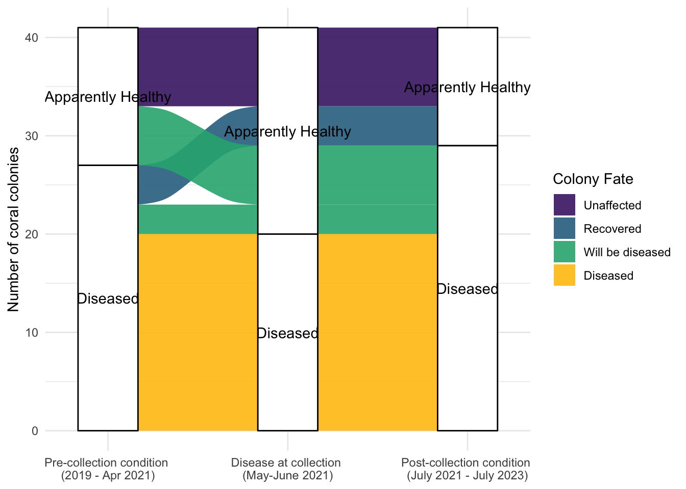
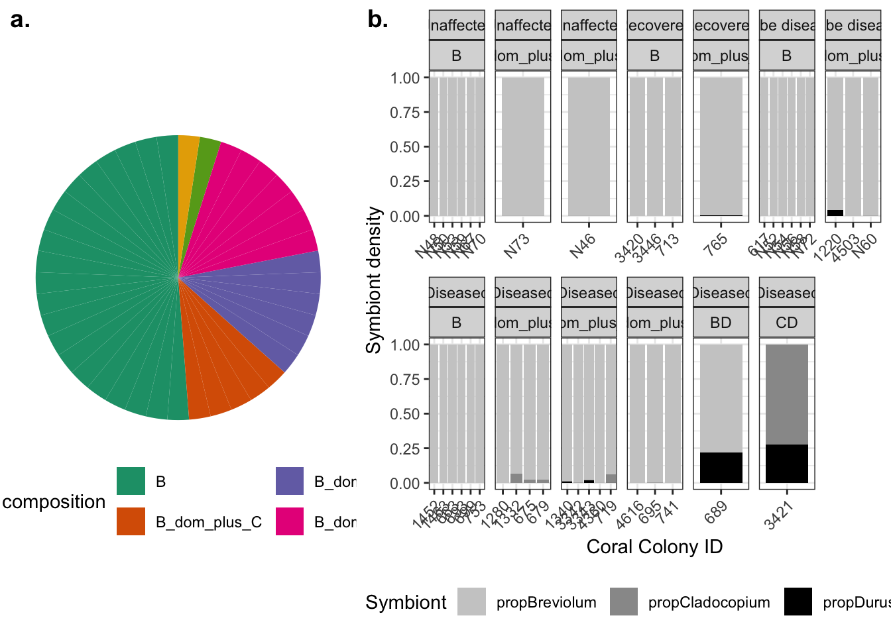

# Setup
## Install necessary packages


``` r
library(ggplot2)
library(dplyr)
library(readxl)
library(stringr)
library(tidyr)
library(tidyverse)
theme_set(theme_bw())
library(ggpubr)
library(ggalluvial)
library(scales)
library(gridGraphics)
```

## Read in data

``` r
# Load metadata
metadata <- as.data.frame(read_excel("../data/FLK_OFAV_MG_prok_coassembly_metadata_RRC_v10.xlsx", na = "NA"))
rownames(metadata) <- metadata$CoralID
```


# Figure 2

**NOTE** The manuscript figure was made in Excel, but the same figure is presented here in R code format. 
Colony fate categories were based on  fate-tracking of 41 Orbicella faveolata colonies every two months for up to five years for the presence of stony coral tissue loss disease. Four "colony fate" categories (number of colonies in parentheses) were defined based on the presence of SCTLD at any point before sampling (as early as 2019), during sampling (June 12-13, 2021), or after sampling (July 2021 -July 2024). These categories were: unaffected (never diseased), recovered (diseased before sampling, but not during or after), will be diseased (not diseased during sampling, but diseased afterwards), and diseased (diseased before, during, and after sampling). Colonies with active SCTLD were treated throughout the study. Prior to microbiome sampling, all apparently healthy colonies in the first bar were not treated (34%, n = 14), while those with active SCTLD were treated (66%, n = 27). Colonies in the will be diseased category include 6 that were apparently healthy and received no antibiotic treatments prior to microbiome sampling and 3 with SCTLD and antibiotic treatments at least 12 months prior to microbiome sampling. 


``` r
# Subset only the FLK data first
FLK_data <- metadata %>%
  filter(Region == "Lower Keys") %>% # only look at FLK samples
  filter(Spp == "Ofav") %>% # remove ofra colonies since I didn't analyze their metagenomes
  filter(CoralID != "N49") %>% # remove the coral colony that wasn't sequenced
  dplyr::select(CoralID, Disease_before_SP1, Disease_on_colony_when_coring_binary, Disease_after_SP1, Fate_after_SP1) %>%
  group_by(Disease_before_SP1, Disease_on_colony_when_coring_binary, Disease_after_SP1, Fate_after_SP1) %>%
  dplyr::summarise(Count = n()) %>%
  ungroup()
```

```
## `summarise()` has grouped output by 'Disease_before_SP1',
## 'Disease_on_colony_when_coring_binary', 'Disease_after_SP1'. You can override
## using the `.groups` argument.
```

``` r
FLK_data$Fate_after_SP1 <- factor(FLK_data$Fate_after_SP1, levels = c("Unaffected", "Recovered", "Will be diseased", "Diseased"))

FLK_data <- FLK_data %>% 
  mutate(Disease_before_SP1 = str_replace_all(Disease_before_SP1, "No data", "Apparently Healthy")) %>%
  mutate(Disease_on_colony_when_coring_binary = str_replace_all(Disease_on_colony_when_coring_binary, "Unaffected", "Apparently Healthy")) %>%
  mutate(Disease_after_SP1 = str_replace_all(Disease_after_SP1, "Unaffected", "Apparently Healthy"))

addline_format <- function(x,...){
    gsub("\\(", "\n(", x)
}

ggplot(FLK_data,
       aes(axis1 = Disease_before_SP1, axis2 = Disease_on_colony_when_coring_binary, axis3 = Disease_after_SP1,
           y = Count)) +
  geom_alluvium(aes(fill = Fate_after_SP1), alpha = 0.9) +
  geom_stratum() +
  geom_text(stat = "stratum", aes(label = after_stat(stratum))) +
  scale_x_discrete(limits = c("Pre-collection condition", "Disease at collection", "Post-collection condition"),
                   expand = c(0.15, 0.05),
                   labels = addline_format(c("Pre-collection condition (2019 - Apr 2021)", 
                        "Disease at collection (May-June 2021)", "Post-collection condition (July 2021 - July 2023)"))) +
  labs(y = "Number of coral colonies", fill = "Colony Fate") +
  theme_minimal() +
  scale_fill_manual(values = c("#482173", "#2e6f8e",  "#29af7f", "#FFC20A"))
```

```
## Warning in to_lodes_form(data = data, axes = axis_ind, discern =
## params$discern): Some strata appear at multiple axes.
## Warning in to_lodes_form(data = data, axes = axis_ind, discern =
## params$discern): Some strata appear at multiple axes.
## Warning in to_lodes_form(data = data, axes = axis_ind, discern =
## params$discern): Some strata appear at multiple axes.
```



``` r
#ggsave("../figures/alluvial_plot_fate.pdf", width = 9, height = 5)
```

Calculate numbers to go in the manuscript

``` r
20/41 # 20 colonies diseased at sampling
```

```
## [1] 0.4878049
```

``` r
(3+3+4+11)/41 # 21 colonies unaffected at sampling
```

```
## [1] 0.5121951
```

``` r
(20+3+3)/41 # colonies that were diseased at sampling and diseased sometime after SP1 out of total colonies
```

```
## [1] 0.6341463
```

``` r
(3 + 3)/41 # colonies unaffected at sampling, but got disease after SP1 (will be diseased) out of total colonies
```

```
## [1] 0.1463415
```

``` r
4/41 # colonies that recoverd from sctld out of all colonies
```

```
## [1] 0.09756098
```

``` r
11/41 # colonies never impacted during monitoring out of all colonies
```

```
## [1] 0.2682927
```

# Figure S3 

Most sampled Orbicella faveolata corals harbored primarily Breviolum photoendosymbionts. a) The proportion of the 41 sampled O. faveolata colonies harboring different groups of photoendosymbiont genera. Inset numbers represent the number of corals in each group. In the legend, a dominant symbiont reflects one that is >90% of the community, with the other representing <10%. In the case of the coral with Breviolum and Durusdinium and the coral with Cladocopium and Durusdinium, both symbiont genera represent more than 10% of the community. b) Proportion of different genera of Symbiodiniaceae photoendosymbionts in each coral. The x axis shows each coral colony ID. In some cases, the proportion of a symbiont may be too small to be visualized in the plot (e.g. Durusdinium density in coral colony 741). The graphs are separated based on overall colony condition at the time of sampling. 

# Make a plot by colony fate

``` r
FLK_metadata <- metadata %>%
  filter(Region == "Lower Keys") %>% # only look at FLK samples
  filter(Spp == "Ofav") %>% # remove ofra colonies since I didn't analyze their metagenomes
  filter(CoralID != "N49") # remove the coral colony that wasn't sequenced

# can I make a stacked bar plot of the actual symbiont composition?
FLK_zoox_fate <- FLK_metadata %>% 
  dplyr::select(CoralID, Zoox_composition_New, Disease_on_colony_when_coring_binary, Fate_after_SP1, propBreviolum, propCladocopium, propDurusdinium) %>%
  gather(key = "Symbiont", value = "Symbiont_Density", propBreviolum:propDurusdinium)

FLK_zoox_fate$Fate_after_SP1 <- factor(FLK_zoox_fate$Fate_after_SP1, levels = c("Unaffected", "Recovered", "Will be diseased", "Diseased"))

# Pie chart of the different corals and their composition
pie <- ggplot(FLK_metadata, aes(x = "", y = "", fill = Zoox_composition_New)) +
  geom_bar(stat = "identity", width = 1) +
  coord_polar("y", start = 0) +
  theme_void() +
  scale_fill_brewer(palette = "Dark2") +
  theme(legend.position = "bottom") +
  labs(fill = "Symbiodiniaceae composition")

barplot_fate <- ggplot(FLK_zoox_fate, aes(x = CoralID, y = Symbiont_Density, fill = Symbiont)) +
  geom_bar(position = "fill", stat = "identity") +
  facet_wrap(. ~ Fate_after_SP1 + Zoox_composition_New, scales = "free_x", ncol = 7) +
  theme(axis.text.x = element_text(angle = 45, hjust = 1)) +
  scale_fill_manual(values = c("gray80", "gray60", "black")) +
  theme(legend.position = "bottom") +
  labs(x = "Coral Colony ID", y = "Symbiont density")

ggarrange(pie, barplot_fate, widths = c(1,1.5), labels = c("a.", "b."))
```



``` r
#ggsave("../figures/zoox_composition_fate.pdf", width = 12, height = 5)
```


