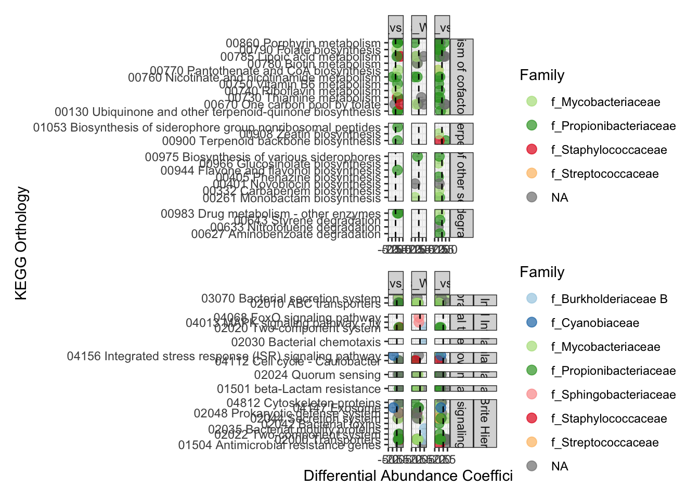

# Setup
## Install necessary packages


``` r
# For data wrangling
library(dplyr)
library(tidyr)
library(readxl)
library(stringr)
library(KEGGREST)

# For visualization
library(corncob)
library(DESeq2)
library(phyloseq)
library(randomcoloR)
library(ggplot2)
theme_set(theme_bw())
library(patchwork)
```


# Genes assoc. with Fate

I want to analyze the differentially abunant genes of only annotated (by KEGG) the microbial genes that were annotated. 

I recently re-ran Salmon to get gene abundances on all the prokaryote genes. The prokaryote genes were identified using EukRep. EukRep split the coassembly into prok and euk fractions. I then got predicted genes from prodigal (output both AA and nucleotide seqs). I took the prok fraction of predicted genes (nucleotide) and re-mapped the noneuk reads on the prok genes to get gene abundances. That is what I am now re-running all the PCA analyses on. I am interested in how genes differ by colony fate when controlling for zoox composition. 

## Data 

``` r
# Load table with count abundances from salmon ("numreads")
prokreads <- read.table("../data/FLK_OFAV_MG_prok_coassembly_salmon_quant_all_NumReads.tsv", header = TRUE, sep = "\t", row.names = 2)
prokreads <- prokreads[, -1] # get rid of the first column cause it is just numbered lines

# Load metadata
metadata <- as.data.frame(read_excel("../data/FLK_OFAV_MG_prok_coassembly_metadata_RRC_v10.xlsx", na = "NA"))
rownames(metadata) <- metadata$CoralID

# remove genes that are zero across all samples (~32k genes)
prokreads_nozero <- prokreads[rowSums(prokreads) != 0, ]

# any samples with no reads? No.
table(colSums(prokreads_nozero) == 0)
```

```
## 
## FALSE 
##    41
```

``` r
# Fix the sample names bc R doesn't like column names that start with a number
colnames(prokreads_nozero) <- str_replace_all(colnames(prokreads_nozero), pattern = "[X]", "")
colnames(prokreads_nozero) <- str_split_i(colnames(prokreads_nozero), "[_]", 1)

# Read in the taxonomy
prok_taxa <- read.table("../data/FLK_OFAV_MG_prok_coassembly_tax_mmseqs2.tsv", header = FALSE, col.names = c("contig", "ncbi_taxid", "rank", "annotation", "complete_classification"), na.strings = "", sep = "\t")
```

### Parse KO data

``` r
# load KO and Gene ids
# Read all lines from the file
lines <- readLines("../data/user_ko.txt")

# Split each line by tab ("\t")
split_lines <- strsplit(lines, "\t")

# Convert the split lines into a data frame
gene_ko <- do.call(rbind, lapply(split_lines, function(x) {
  if (length(x) == 1) {
    c(x[1], NA)  # If only one column, fill second column with NA
  } else {
    x  # Keep both columns
  }
}))

# Assign column names
colnames(gene_ko) <- c("geneID", "KO")

dim(gene_ko)
unique(gene_ko) %>% dim

# Convert to a data frame
gene_ko <- as.data.frame(gene_ko, stringsAsFactors = FALSE)

# how many unique KO ids?
gene_ko$KO %>% unique %>% length

# View the resulting data
print(head(gene_ko))

# Read in the table of the annotations
ko_info <- read_excel("../data/kegg_data.xlsx", col_names = TRUE, na = "")

# Get rid of the "KO" in the first column
ko_info$ENTRY <- str_split_i(ko_info$ENTRY, " ", 1)

head(ko_info)
dim(ko_info)

# How many unique KOs? 4563
ko_info$KO_ID %>% unique %>% length
ko_info$ENTRY %>% unique %>% length

# There's too many duplicate rows. Should have only 4,563
ko_info_nodups <- unique(ko_info)

# add the annotation info to the gene_ko documant
gene_ko_join <- gene_ko %>%
  left_join(ko_info_nodups, by = c("KO" = "ENTRY"))

# How many genes are annotated? 32,980
sum(!is.na(gene_ko_join$KO))

# Filter to only include the annotated columns (should end with 32,980 rows)
gene_ko_annotated <- gene_ko_join[!is.na(gene_ko_join$KO), ]

# It looks like there are some duplicated gene IDs
gene_ko_annotated$geneID %>% unique %>% length

# Get rid of duplicate geneID's
unique_gene_ko_annotated<- gene_ko_annotated[!duplicated(gene_ko_annotated$geneID), ]
dim(unique_gene_ko_annotated)

# Rename the rows 
rownames(unique_gene_ko_annotated) <- unique_gene_ko_annotated[,"geneID"]
```

## Phyloseq object
Start with a phyloseq object jsut with the count data (no annotation information). The annotations aren't needed for the PCAs I want to make. 

``` r
## Make phyloseq object of count-related data 
idx <- match(colnames(prokreads_nozero), rownames(metadata))
metadata_prok <- metadata[idx,] # subset the metadata to only the sequenced samples

NUMREADS = otu_table(prokreads_nozero, taxa_are_rows = TRUE)
META = sample_data(metadata_prok)
FXN = tax_table(as.matrix(unique_gene_ko_annotated))

ps.prok.annotated <- phyloseq(NUMREADS, META, FXN)
ps.prok.annotated
```

```
## phyloseq-class experiment-level object
## otu_table()   OTU Table:         [ 31695 taxa and 41 samples ]
## sample_data() Sample Data:       [ 41 samples by 40 sample variables ]
## tax_table()   Taxonomy Table:    [ 31695 taxa by 12 taxonomic ranks ]
```

# Differential Abundance Analysis

## Corncob

I would like to analyze the Colony fate category. This time, I will use that, and again control for zoox. 


``` r
## Set levels
sample_data(ps.prok.annotated)$Fate_after_SP1 <-
  factor(sample_data(ps.prok.annotated)$Fate_after_SP1, 
         levels = c("Unaffected", "Recovered", "Will be diseased", "Diseased"))

#head(sample_data(ps.prok.annotated)$Fate_after_SP1, 10) # levels look good

sample_data(ps.prok.annotated)$Zoox_composition_New <- 
  factor(sample_data(ps.prok.annotated)$Zoox_composition_New, 
         levels = c("B", "B_dom_plus_C", "B_dom_plus_CD", "B_dom_plus_D", "BD", "CD"))

#head(sample_data(ps.prok.annotated)$Zoox_composition_New, 10) # levels look good

## Test disease on colony when coring and control for symbiont composition
set.seed(10) # set seed for reproducibility
prok.da.fate <- differentialTest(formula = ~ Fate_after_SP1 + Zoox_composition_New, 
                                  phi.formula = ~ Fate_after_SP1 + Zoox_composition_New,
                                  formula_null = ~ Zoox_composition_New,
                                  phi.formula_null = ~ Fate_after_SP1 + Zoox_composition_New,
                                  test = "Wald", boot = FALSE,
                                  data = ps.prok.annotated,
                                  fdr_cutoff = 0.05)

#plot(prok.da.fate, level = "SYMBOL")
#prok.da.fate$significant_taxa
```
Looks like there are 392 differentially abundant genes by different categories! I'll dig into these to see how best to represent these different groupings. 

Save all the data. 

``` r
# write a function to extract the corncob results
extractmods3 <- function(model) {
  result <- data.frame("Estimate" = model$coefficients[2:4, 1], 
                        "Std.Error" = model$coefficients[2:4, 2], 
                        "p" = model$coefficients[2:4, 4], 
                       "Comparison" = c("Unaffected_vs_Recovered",
                                        "Unaffected_vs_WillbeDiseased",
                                        "Unaffected_vs_Diseased"))
  return(result)
}

# save the output as a list using the above function
sig.models.fate <- lapply(prok.da.fate$significant_models, extractmods3)
names(sig.models.fate) <- prok.da.fate$significant_taxa

# save a table of annotations for just the significant genes
sig.fxnl.genes.fate <- filter(unique_gene_ko_annotated, geneID %in% prok.da.fate$significant_taxa)

# turn the output from a list to a dataframe for ease of saving and manipulating
sig.models.df.fate <- plyr::ldply(sig.models.fate, data.frame) %>% 
  mutate(significant = ifelse(p < 0.05, TRUE, FALSE)) %>%
  left_join(sig.fxnl.genes.fate, by = c(".id" = "geneID")) %>%
  left_join(prok_taxa, by = c(".id" = "contig"))

### Save these data so you don't have to re-run the model ###
#write.table(sig.models.df.fate, "../data/Corncob_prok_annotated_results_FATE_07.28.25.txt", sep="\t", row.names = FALSE, col.names = TRUE)
```

## Process output

How many different genes are there significant at a adjusted p value < 0.001?

``` r
filter(sig.models.df.fate, p < 0.001) #162 comparisons
filter(sig.models.df.fate, Estimate > 0) #536 comparisons 
filter(sig.models.df.fate, Estimate < 0) #640 comparisons

sig.models.df.fate$KO %>% length #1176
sig.models.df.fate$KO %>% unique %>% length #356

sig.taxa.fate <- sig.models.df.fate$KO %>% unique

#write(sig.taxa.fate, file = "sig.taxa.KO.fate.txt")
```

I will manipulate the data table output so that I can get a table that shows the KEGG Orthology information clearly.

Loop through a bunch of KO ids. I will loop through all the KO IDs and get them combined. 

``` r
# List of KO identifiers
ko_ids.fate <- readLines("sig.taxa.KO.fate.txt")

ko_ids_testgroup <- c("K09125", "K00950", "K15738", "K07457", "K24163", "K00059")

# Create an empty dataframe to store parsed data for all KO IDs
parsed_data.fate <- data.frame(KO = character(), 
                          BRITEhierarchy = character(),
                          Level2 = character(),
                          Level3 = character(),
                          Level4 = character(),
                          Level5 = character(),
                          Level6 = character(),
                          KO_DETAILS = character(),
                          stringsAsFactors = FALSE)

# Loop through each KO ID
for (ko_id in ko_ids.fate) {
  
  # Retrieve information for the KO
  ko_info <- keggGet(ko_id)
  
  # Note which KO ID you are on
  print(paste("Processing KO ID: ", ko_id))
  
  # Check if the KO ID has BRITE hierarchy data
  if (!is.null(ko_info[[1]]$BRITE)) {
    brite <- ko_info[[1]]$BRITE  # Extract the BRITE section
    
    # Initialize variables for hierarchy levels
    brite_hierarchy <- level2 <- level3 <- level4 <- level5 <- level6 <- NA
    
    # Process each line in the BRITE section
    for (line in brite) {
      
      # Determine indentation level (number of leading spaces)
      indentation <- attr(regexpr("^\\s*", line), "match.length")  # Count spaces
      content <- trimws(line)  # Remove leading/trailing spaces
      
      if (indentation == 0) {
          # Top-level category (Level1)
          brite_hierarchy <- content
          level2 <- level3 <- level4 <- level5 <- level6 <- NA  # Reset lower levels
      } else if (indentation == 1) {
          # Second-level category (Level2)
          level2 <- content
          level3 <- level4 <- level5 <- level6 <- NA  # Reset lower levels
      } else if (indentation == 2) {
          # Third-level category (Level3)
          level3 <- content
          level4 <- level5 <- level6 <- NA  # Reset lower level
      } else if (indentation == 3) {
          # KO entry or Fourth-level category (Level4)
          if (grepl("^K[0-9]+", content)) {  # Check if it's a KO entry
            ko_details <- content
            parsed_data.fate <- rbind(parsed_data.fate, data.frame(KO = ko_id, 
                                                         BRITEhierarchy = brite_hierarchy,
                                                         Level2 = level2,
                                                         Level3 = level3,
                                                         Level4 = level4,
                                                         Level5 = level5,
                                                         Level6 = level6,
                                                         KO_DETAILS = ko_details,
                                                         stringsAsFactors = FALSE))
          } else { 
            level4 <- content
            level5 <- level6 <- NA
          }
      } else if (indentation == 4) {
          # KO entry or Fifth-level category (Level5)
          if (grepl("^K[0-9]+", content)) {  # Check if it's a KO entry
            ko_details <- content
            parsed_data.fate <- rbind(parsed_data.fate, data.frame(KO = ko_id, 
                                                         BRITEhierarchy = brite_hierarchy,
                                                         Level2 = level2,
                                                         Level3 = level3,
                                                         Level4 = level4,
                                                         Level5 = level5,
                                                         Level6 = level6,
                                                         KO_DETAILS = ko_details,
                                                         stringsAsFactors = FALSE))
          } else {
            level5 <- content
            level6 <- NA
          }
      } else if (indentation == 5) {
          # KO entry or or Sixth-level category (Level6)
          if (grepl("^K[0-9]+", content)) {  # Check if it's a KO entry
            ko_details <- content
            parsed_data.fate <- rbind(parsed_data.fate, data.frame(KO = ko_id, 
                                                         BRITEhierarchy = brite_hierarchy,
                                                         Level2 = level2,
                                                         Level3 = level3,
                                                         Level4 = level4,
                                                         Level5 = level5,
                                                         Level6 = level6,
                                                         KO_DETAILS = ko_details,
                                                         stringsAsFactors = FALSE))
          } else {
            level6 <- content
          }
      } else if (indentation == 6) {
        # KO entry or or Seventh-level category (Level7)
          if (grepl("^K[0-9]+", content)) {  # Check if it's a KO entry
            ko_details <- content
            parsed_data.fate <- rbind(parsed_data.fate, data.frame(KO = ko_id, 
                                                         BRITEhierarchy = brite_hierarchy,
                                                         Level2 = level2,
                                                         Level3 = level3,
                                                         Level4 = level4,
                                                         Level5 = level5,
                                                         Level6 = level6,
                                                         KO_DETAILS = ko_details,
                                                         stringsAsFactors = FALSE))
          } else {
            ko_details <- paste("WARNING, doesn't match KO ID", content)
            parsed_data.fate <- rbind(parsed_data.fate, data.frame(KO = ko_id, 
                                                         BRITEhierarchy = brite_hierarchy,
                                                         Level2 = level2,
                                                         Level3 = level3,
                                                         Level4 = level4,
                                                         Level5 = level5,
                                                         Level6 = level6,
                                                         KO_DETAILS = ko_details,
                                                         stringsAsFactors = FALSE))
          } 
      } else {
          # For unexpected cases, add a catch-all (optional)
          warning(paste("Unexpected indentation level encountered: ", indentation, "for the following KO: ", ko_id))
      }
    }
  } else {
    warning(paste("No BRITE data found for KO ID:", ko_id))
  }
}

# View the parsed hierarchy
# print(parsed_data.fate)
```

Now, the `parsed_data.fate` data frame is the BRITE hierarchy data for the significant taxa. Ultimately, I just want the KEGG orthology data for each of these KO IDs. 

Then, I will make a data table of the estimates and make a figure of the corncob results. I will subset only of the KEGG Orthology annotations. Then I will focus on specifically metabolism-based KEGG Orthology annotations since those have an ecological function more than things like "DNA repair" or similar. 


``` r
KEGG_Orthology_sig_ko.fate <- parsed_data.fate %>%
  filter(BRITEhierarchy == "KEGG Orthology (KO) [BR:ko00001]") %>%
  filter(Level2 == "09100 Metabolism")

# Potential functional hierarchies to look into and graph
parsed_data.fate %>%
  filter(BRITEhierarchy != "KEGG Orthology (KO) [BR:ko00001]") %>%
  dplyr::select(BRITEhierarchy) %>%
  unique
```

```
##                                                       BRITEhierarchy
## 1                                 Transcription factors [BR:ko03000]
## 2                                               Enzymes [BR:ko01000]
## 3                              DNA replication proteins [BR:ko03032]
## 4                 DNA repair and recombination proteins [BR:ko03400]
## 6                            Amino acid related enzymes [BR:ko01007]
## 7                               Transfer RNA biogenesis [BR:ko03016]
## 9                                          Transporters [BR:ko02000]
## 11                                             Ribosome [BR:ko03011]
## 19                   Chromosome and associated proteins [BR:ko03036]
## 21                                  Ribosome biogenesis [BR:ko03009]
## 24                                              Exosome [BR:ko04147]
## 28                            Peptidases and inhibitors [BR:ko01002]
## 30                     Chaperones and folding catalysts [BR:ko03110]
## 31                                     Secretion system [BR:ko02044]
## 36                              Transcription machinery [BR:ko03021]
## 49                                  Translation factors [BR:ko03012]
## 51                             Mitochondrial biogenesis [BR:ko03029]
## 54                              Photosynthesis proteins [BR:ko00194]
## 59                                 Glycosyltransferases [BR:ko01003]
## 65                           Prokaryotic defense system [BR:ko02048]
## 67                                Cytoskeleton proteins [BR:ko04812]
## 70                                      Protein kinases [BR:ko01001]
## 71                                 Two-component system [BR:ko02022]
## 77  Peptidoglycan biosynthesis and degradation proteins [BR:ko01011]
## 79         Protein phosphatases and associated proteins [BR:ko01009]
## 112                         Lipid biosynthesis proteins [BR:ko01004]
## 125                            Messenger RNA biogenesis [BR:ko03019]
## 136                                Membrane trafficking [BR:ko04131]
## 192                      Antimicrobial resistance genes [BR:ko01504]
## 214                         Bacterial motility proteins [BR:ko02035]
## 339                                    Bacterial toxins [BR:ko02042]
## 500                                  Prenyltransferases [BR:ko01006]
```

``` r
#did i capture all the KOs? NO - only 165 out of all of them
KEGG_Orthology_sig_ko.fate$KO %>% unique %>% length
```

```
## [1] 165
```

``` r
parsed_data.fate$KO %>% unique %>% length
```

```
## [1] 356
```

``` r
# For each of the KO identifiers, match the gene ID and the associated abundance to that KO. There are multiple duplicate annotations for each KO, and duplicate genes that match a KO, so it is going to be a bit of an "all against all" match up. I also want to add the taxonomy results. 
sig.ko.tax.data.fate <- sig.models.df.fate %>%
  dplyr::select(.id:NAME, DBLINKS, annotation, complete_classification) %>%
  full_join(parsed_data.fate, by = "KO", relationship = "many-to-many")

# Check that there are still just 392 unique genes
# sig.ko.tax.data.fate$.id %>% unique %>% length

### Save these data so you have the fully parsed out annotations for each gene (there will be more rows than columns) ###
#write.table(sig.ko.tax.data.fate, "../data/Corncob_prok_annotated_results_FATE_07.28.25_ANNOTATIONS.txt", sep="\t", row.names = FALSE, col.names = TRUE)
```

## Metabolism results

Keep in mind when visualizing: even within one metabolism-based annotation, one gene may play a role in multiple metabolic pathways, so it can have multiple annotations. So when I visualize the data, that is going to be reflected. 

Additionally, since I did a corncob test with multiple levels, I am not sure I want to show the output of those that are NOT significant, since it might be misleading. So I'll have to think about how to display that. 

I want to show the metabolism-based results. I will plot the coefficient since that reflects how much something increased or decreased in the different conditions. 


``` r
# How many genes have a Metabolism function? 180
sig.ko.tax.data.fate %>% 
  filter(BRITEhierarchy == "KEGG Orthology (KO) [BR:ko00001]") %>%
  filter(Level2 == "09100 Metabolism") %>%
  dplyr::select(.id) %>%
  unique %>% 
  nrow
```

```
## [1] 180
```

``` r
# How many KO ids have a Metabolism function? 165
sig.ko.tax.data.fate %>% 
  filter(BRITEhierarchy == "KEGG Orthology (KO) [BR:ko00001]") %>%
  filter(Level2 == "09100 Metabolism") %>%
  dplyr::select(KO) %>%
  unique %>% 
  nrow
```

```
## [1] 165
```

``` r
# Subset genes with metabolism annotations - need to facet with the different categories...
sig.metab.genes.fate <- sig.ko.tax.data.fate %>% 
  filter(BRITEhierarchy == "KEGG Orthology (KO) [BR:ko00001]") %>%
  filter(Level2 == "09100 Metabolism") %>%
  mutate(Comparison = factor(Comparison, levels = c("Unaffected_vs_Recovered", "Unaffected_vs_WillbeDiseased", "Unaffected_vs_Diseased")))

# How many genes in the different categories?
summary_table <- sig.metab.genes.fate %>%
  filter(significant == TRUE) %>% 
  mutate(posneg = ifelse(Estimate > 0, "positive", "negative")) %>%
  dplyr::select(.id, Comparison, posneg, Level3) %>% #slect columns of interest
  distinct(.id, Comparison, posneg, Level3) %>% 
  group_by(Level3, posneg, Comparison) %>%
  summarize(UniqueGenes = n_distinct(.id), .groups = "drop") %>% 
  spread(posneg, UniqueGenes)

print(summary_table)
```

```
## # A tibble: 31 × 4
##    Level3                        Comparison                   negative positive
##    <chr>                         <fct>                           <int>    <int>
##  1 09101 Carbohydrate metabolism Unaffected_vs_Recovered            NA       19
##  2 09101 Carbohydrate metabolism Unaffected_vs_WillbeDiseased        7        1
##  3 09101 Carbohydrate metabolism Unaffected_vs_Diseased             23        7
##  4 09102 Energy metabolism       Unaffected_vs_Recovered             3        7
##  5 09102 Energy metabolism       Unaffected_vs_WillbeDiseased        6        1
##  6 09102 Energy metabolism       Unaffected_vs_Diseased             24        3
##  7 09103 Lipid metabolism        Unaffected_vs_Recovered            NA        1
##  8 09103 Lipid metabolism        Unaffected_vs_WillbeDiseased        1       NA
##  9 09103 Lipid metabolism        Unaffected_vs_Diseased              9       NA
## 10 09104 Nucleotide metabolism   Unaffected_vs_Recovered             1        5
## # ℹ 21 more rows
```

Subset genes w/ taxonomy

``` r
# Subset the DA genes to those that are involved in secondary metabolite or vitamin production
sig.metab.genes.fate.subsetforgraph.vits <- sig.metab.genes.fate %>%
  filter(significant == TRUE) %>%
  filter(Level3 %in% c("09109 Metabolism of terpenoids and polyketides", 
                       "09110 Biosynthesis of other secondary metabolites", 
                       "09111 Xenobiotics biodegradation and metabolism",
                       "09108 Metabolism of cofactors and vitamins"))

## Add taxonomy information
sig.metab.genes.fate.subsetforgraph.vits.tax <- sig.metab.genes.fate.subsetforgraph.vits %>%
    separate(complete_classification, 
           into = c("Domain", "Phylum", "Class", "Order", "Family", "Genus", "Species"), 
           sep = "[;]", remove = FALSE)
```

```
## Warning: Expected 7 pieces. Missing pieces filled with `NA` in 19 rows [6, 12, 13, 22,
## 24, 36, 39, 40, 51, 52, 53, 56, 57, 61, 64, 65, 66, 67, 73].
```

## Non-metabolism results

It looks like 180 out of the 392 genes were involved in metabolism functions. What about the other half? I am going to go through and assess and graph the other genes. First, I need to subset the data to only look at the remaining genes. 


``` r
# Get a list of all the genes from the first graph
metab.genes.fate.id <- sig.metab.genes.fate$.id %>% unique

# Subset the data to exclude the metab.genes.id values
sig.nonmetab.genes.fate <- sig.ko.tax.data.fate[!sig.ko.tax.data.fate$.id %in% metab.genes.fate.id, ]

# Double check how many unique genes in the new data frame (212 - good! adds up to 392 with 180)
sig.nonmetab.genes.fate$.id %>% unique %>% length
```

```
## [1] 212
```

``` r
# Subset the KO data since it includes all 179 genes
sig.nonmetab.genes.fate.KO <- sig.nonmetab.genes.fate %>% 
  filter(BRITEhierarchy == "KEGG Orthology (KO) [BR:ko00001]") %>%
  filter(significant == TRUE) %>%
  mutate(Comparison = factor(Comparison, levels = c("Unaffected_vs_Recovered", "Unaffected_vs_WillbeDiseased", "Unaffected_vs_Diseased")))

# How many genes in the different categories?
summary_table_nonmetab <- sig.nonmetab.genes.fate.KO %>%
  mutate(posneg = ifelse(Estimate > 0, "positive", "negative")) %>%
  dplyr::select(.id, Comparison, posneg, Level3) %>% #slect columns of interest
  distinct(.id, Comparison, posneg, Level3) %>% 
  group_by(Level3, posneg, Comparison) %>%
  summarize(UniqueGenes = n_distinct(.id), .groups = "drop") %>% # count unique genes
  spread(posneg, UniqueGenes)

print(summary_table_nonmetab)
```

```
## # A tibble: 60 × 4
##    Level3                                 Comparison           negative positive
##    <chr>                                  <fct>                   <int>    <int>
##  1 09121 Transcription                    Unaffected_vs_Recov…       NA        2
##  2 09121 Transcription                    Unaffected_vs_Willb…       NA        1
##  3 09121 Transcription                    Unaffected_vs_Disea…        1        2
##  4 09122 Translation                      Unaffected_vs_Recov…        1        3
##  5 09122 Translation                      Unaffected_vs_Willb…        7       NA
##  6 09122 Translation                      Unaffected_vs_Disea…       18       NA
##  7 09123 Folding, sorting and degradation Unaffected_vs_Recov…        2        4
##  8 09123 Folding, sorting and degradation Unaffected_vs_Willb…        3       NA
##  9 09123 Folding, sorting and degradation Unaffected_vs_Disea…       12        1
## 10 09124 Replication and repair           Unaffected_vs_Recov…        2        4
## # ℹ 50 more rows
```

Many of the differentially abundant genes that I would hypothesize are playing a role in microbial-based disease susceptibility or resilience are in the Environmental Information Processing, Cellular processes, Drug resistance, and protein families, signalling and cellular processes groups. I will make a graph with just those categories. I will ignore the human disease ones because I anticipate those are relevant to human pathogens, which I don't think would be abundant on the reefs. 

Subset non-metabolism genes w/ taxonomy

``` r
# Include groups 
sig.nonmetab.genes.fate.KO.subsetforgraph <- sig.nonmetab.genes.fate.KO %>%
  filter(Level3 %in% c("09131 Membrane transport",
                       "09132 Signal transduction", 
                       "09142 Cell motility",
                       "09143 Cell growth and death", 
                       "09145 Cellular community - prokaryotes",
                       "09175 Drug resistance: antimicrobial",
                       "09183 Protein families: signaling and cellular processes"))

## Add taxonomy information
sig.nonmetab.genes.fate.KO.subsetforgraph.tax <- sig.nonmetab.genes.fate.KO.subsetforgraph %>%
    separate(complete_classification, 
           into = c("Domain", "Phylum", "Class", "Order", "Family", "Genus", "Species"), 
           sep = "[;]", remove = FALSE)
```

```
## Warning: Expected 7 pieces. Missing pieces filled with `NA` in 29 rows [40, 41, 42, 43,
## 47, 49, 50, 51, 52, 53, 54, 55, 75, 79, 104, 105, 106, 109, 110, 111, ...].
```


# Figure 4

Genes involved in metabolism of secondary metabolites and other natural products, as well as those involved in signal transduction and cellular processes were less abundant in diseased and corals that will be diseased categories as compared to unaffected colonies, but enriched in corals recovered from SCTLD (Corncob, Benjamini-Hochberg false discovery rate corrected p < 0.05). The differential abundance coefficient represents how much the modeled relative abundance of a gene was enriched or depleted relative to the baseline (unaffected colonies, dotted line at zero). Error bars reflect 95% confidence intervals around the coefficient. Results are organized by KEGG hierarchy, with the top panel representing metabolism genes, and the bottom panel representing all other processes. There are some points (genes) that are repeated due to their involvement in multiple pathways and roles. The color represents the family and phylum-level annotations for a given predicted gene from the GTDB database. These differentially abundant genes are a subset of all. See Table S6 for a list of all 392 genes and the comparisons for which they were significantly differentially abundant. 


``` r
# Metabolism genes subset
c <- ggplot(sig.metab.genes.fate.subsetforgraph.vits.tax, aes(x = Estimate, y = Level4)) +
  geom_errorbar(aes(xmin = Estimate-Std.Error, xmax = Estimate+Std.Error), width = 0.2, color = "gray") +
  geom_point(alpha = 0.7, size = 3, aes(color = Family)) +
  facet_grid(Level3 ~ Comparison, space = "free", scales = "free_y") +
  labs(x = "Differential Abundance Coefficient", y = "KEGG Orthology") +  
  geom_vline(xintercept = 0, linetype = "dashed") +
#  xlim(-5, 2) +
  scale_color_manual(values = c("#B2DF8A", "#33A02C", "#E31A1C", "#FDBF6F", "#FF7F00", "#CAB2D6", "#6A3D9A", "#FFFF99","#B15928"))

# Non-metabolism genes subset
d <- ggplot(sig.nonmetab.genes.fate.KO.subsetforgraph.tax, aes(x = Estimate, y = Level4)) +
  geom_errorbar(aes(xmin = Estimate-Std.Error, xmax = Estimate+Std.Error), width = 0.2, color = "gray") +
  geom_point(alpha = 0.7, size = 3, aes(color = Family)) +
  facet_grid(Level2 + Level3 ~ Comparison, space = "free", scales = "free_y") +
  labs(x = "Differential Abundance Coefficient", y = "KEGG Orthology") +  
  geom_vline(xintercept = 0, linetype = "dashed") +
 # xlim(-5, 2) +
  scale_color_manual(values = c("#A6CEE3", "#1F78B4", "#B2DF8A", "#33A02C", "#FB9A99", "#E31A1C", "#FDBF6F", "#FF7F00", "#CAB2D6", "#6A3D9A", "#FFFF99","#B15928"))

wrap_plots(c,d, nrow = 2, heights = c(1.3,1), axis_titles = "collect")
```



# Table S5

``` r
sig.metab.genes.fate.subsetforgraph.vits.tax
sig.nonmetab.genes.fate.KO.subsetforgraph.tax

#write.table(sig.metab.genes.fate.subsetforgraph.vits.tax, "../data/DA_MainFig_Gene_Information_FATE_a_07.29.25.txt", sep="\t", row.names = FALSE, col.names = TRUE)
#write.table(sig.nonmetab.genes.fate.KO.subsetforgraph.tax, "../data/DA_MainFig_Gene_Information_FATE_b_07.29.25.txt", sep="\t", row.names = FALSE, col.names = TRUE)
```

