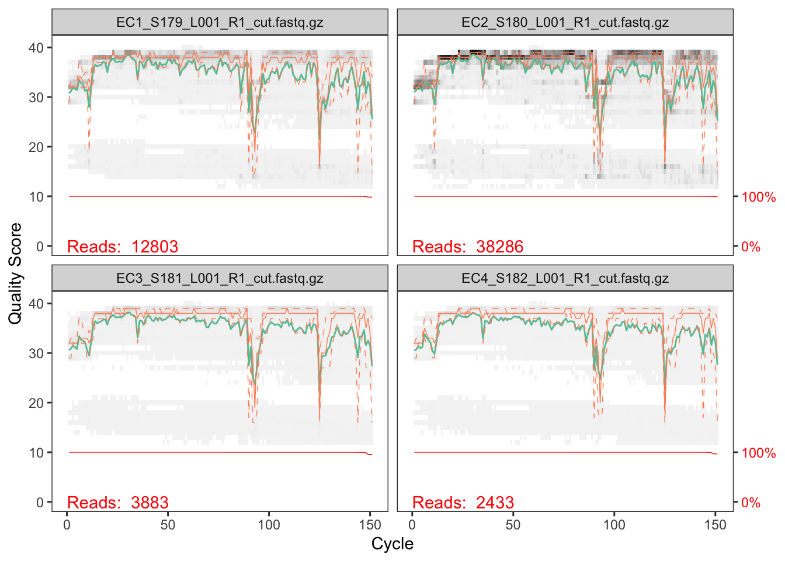
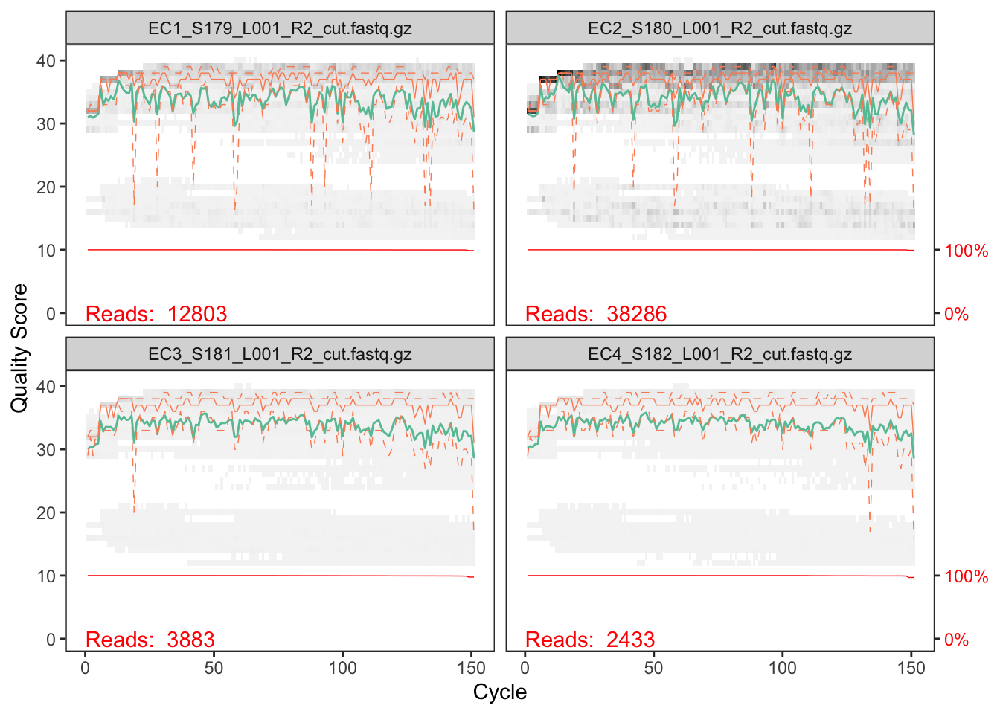
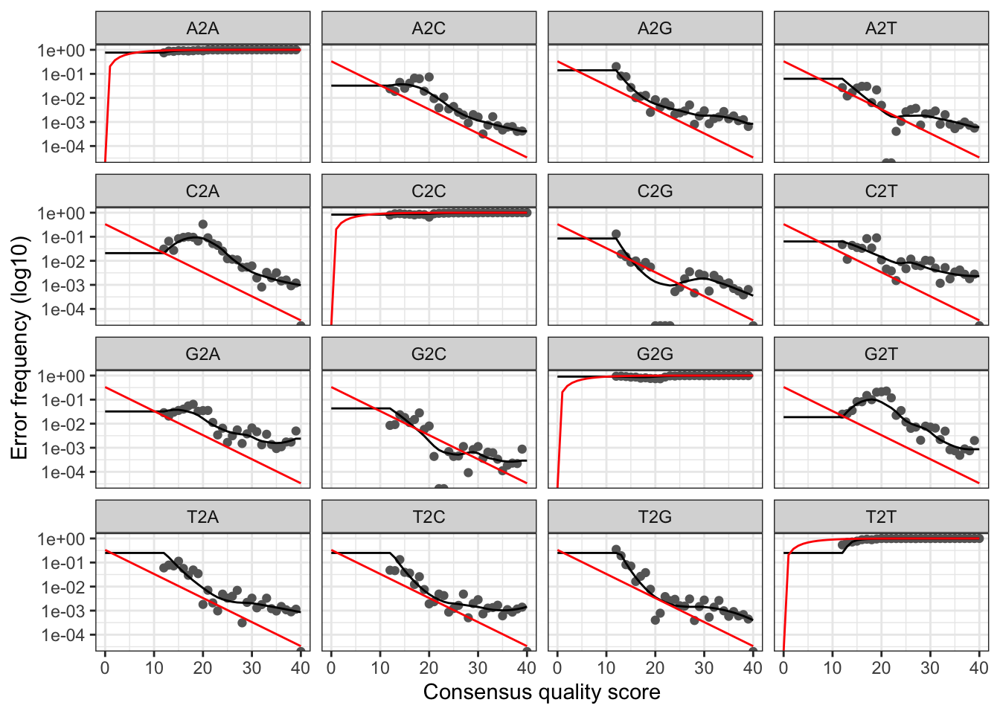
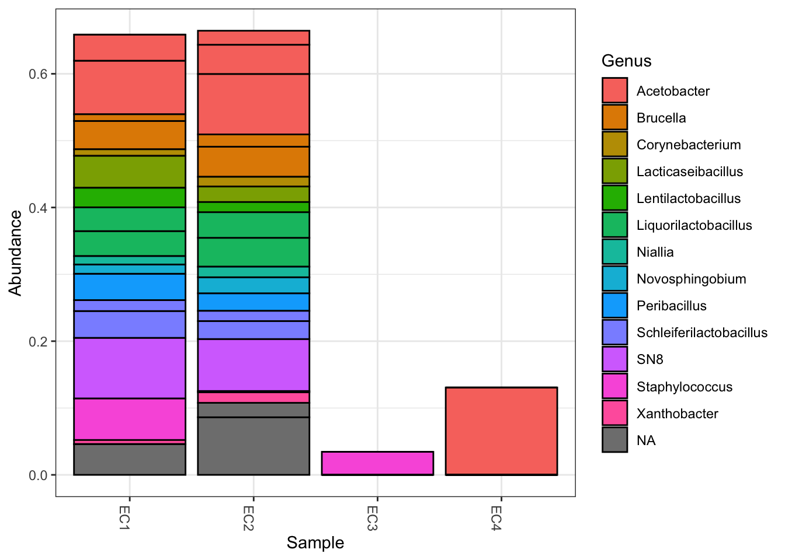

## Microbiome blank analysis

Since the metagenomics analysis is expensive and requires specific concentrations, we didn't send any DNA extraction blanks to the sequencing center for shotgun metagenomics. In order to evaluate any potential contamination, though, we did subject the blanks to 16S rRNA microbiome sequencing. While this includes an amplification step, it will give us a sense of what microbes are in the blank samples that may have also been sequenced metagenomically. If there are some taxa that overlap, I could consider removing them from the analysis.

# Criteria before I start

- Samples have been demultiplexed, i.e. split into individual per-sample fastq files.
YES! 
- Non-biological nucleotides have been removed, e.g. primers, adapters, linkers, etc.
YES! It looks like Julie used cutadapt to remove the different primers and adapters. 
- If paired-end sequencing data, the forward and reverse fastq files contain reads in matched order.
Not sure about this, but hopefully yes!

# Load packages and data


``` r
library(dada2); packageVersion("dada2")
```

```
## Loading required package: Rcpp
```

```
## Warning: package 'Rcpp' was built under R version 4.3.3
```

```
## [1] '1.30.0'
```

``` r
library(phyloseq)
library(tidyverse)
```

```
## Warning: package 'lubridate' was built under R version 4.3.3
```

```
## ── Attaching core tidyverse packages ──────────────────────── tidyverse 2.0.0 ──
## ✔ dplyr     1.1.4     ✔ readr     2.1.5
## ✔ forcats   1.0.0     ✔ stringr   1.5.1
## ✔ ggplot2   3.5.1     ✔ tibble    3.2.1
## ✔ lubridate 1.9.4     ✔ tidyr     1.3.1
## ✔ purrr     1.0.2
```

```
## ── Conflicts ────────────────────────────────────────── tidyverse_conflicts() ──
## ✖ dplyr::filter() masks stats::filter()
## ✖ dplyr::lag()    masks stats::lag()
## ℹ Use the conflicted package (<http://conflicted.r-lib.org/>) to force all conflicts to become errors
```

``` r
library(ggplot2)
theme_set(theme_bw())
library(microViz)
```

```
## Warning: package 'microViz' was built under R version 4.3.3
```

```
## microViz version 0.12.6 - Copyright (C) 2021-2024 David Barnett
## ! Website: https://david-barnett.github.io/microViz
## ✔ Useful?  For citation details, run: `citation("microViz")`
## ✖ Silence? `suppressPackageStartupMessages(library(microViz))`
```

``` r
library(kableExtra)
```

```
## 
## Attaching package: 'kableExtra'
## 
## The following object is masked from 'package:dplyr':
## 
##     group_rows
```

## data


Read in the names of the fastq files and use string manipulation to get the different file names and match the fo4rward and reverse reads. 

``` r
# Forward and reverse fastq filenames have format: SAMPLENAME_L001_R1_cut.fastq.gz and SAMPLENAME_L001_R2_cut.fastq.gz
fnFs <- sort(list.files(path, pattern="_L001_R1_cut.fastq.gz", full.names = TRUE))
fnRs <- sort(list.files(path, pattern="_L001_R2_cut.fastq.gz", full.names = TRUE))

# Extract sample names, assuming filenames have format: SAMPLENAME_XXX.fastq
sample.names <- sapply(strsplit(basename(fnFs), "_"), `[`, 1)
```

# Plot and inspect quality profiles

``` r
plotQualityProfile(fnFs[1:4])
```


IN a shock to noone, they are pretty mediocre quality profiles. This is because they are low biomass blank samples, so they look fairly shitty. That is ok though! Surprisingly, actually, there are a lot of reads in EC2, about 38k. That's quite a bit!


``` r
plotQualityProfile(fnRs[1:4])
```


As expected, these have the same number of reads as the forward reads. Additionally, they are of lower quality, which is normal for reverse reads. Since these are 150 bp reads, they aren't getting cut off as much, which is great. I will just cut 5 bp off the end to get rid of any really big dros in quality. 

# Filter and trim

Assign file names for the filtered fastq files 


``` r
# Place filtered files in filtered/ subdirectory
filtFs <- file.path(path, "filtered", paste0(sample.names, "_F_cut_filt.fastq.gz"))
filtRs <- file.path(path, "filtered", paste0(sample.names, "_R_cut_filt.fastq.gz"))
names(filtFs) <- sample.names
names(filtRs) <- sample.names
```

Use stansdard filtering parameters along with the truncation lengths indicated from the quality profiles. 

``` r
out <- filterAndTrim(fnFs, filtFs, fnRs, filtRs, truncLen=c(145,145),
              maxN=0, maxEE=c(2,2), truncQ=2, rm.phix=TRUE,
              compress=TRUE, multithread=TRUE)
head(out)

# What percent of reads retained?
as.data.frame(out) %>% 
  mutate(reads.retained = reads.out/reads.in)
```

Looks like a lot of reads were dropped for EC3 adnd EC4, which had pretty few reads overall. ZThe first 2, which had a lot more reeads, retained 75% to 91% of reads. 

# Learn Error Rates

The DADA2 algorithm makes use of a parametric error model (`err`) and every amplicon dataset has a different set of error rates. The `learnErrors` method learns this error model from the data, by alternating estimation of the error rates and inference of sample composition until they converge on a jointly consistent solution. As in many machine-learning problems, the algorithm must begin with an initial guess, for which the maximum possible error rates in this data are used (the error rates if only the most abundant sequence is correct and all the rest are errors).


``` r
errF <- learnErrors(filtFs, multithread=TRUE)
```

```
## 6860385 total bases in 47313 reads from 4 samples will be used for learning the error rates.
```

``` r
errR <- learnErrors(filtRs, multithread=TRUE)
```

```
## 6860385 total bases in 47313 reads from 4 samples will be used for learning the error rates.
```

``` r
# Check out the error rates
plotErrors(errF, nominalQ=TRUE)
```

```
## Warning in scale_y_log10(): log-10 transformation introduced infinite values.
## log-10 transformation introduced infinite values.
```



The error rates for each possible transition (A→C, A→G, …) are shown. Points are the observed error rates for each consensus quality score. The black line shows the estimated error rates after convergence of the machine-learning algorithm. The red line shows the error rates expected under the nominal definition of the Q-score. Here the estimated error rates (black line) are a good fit to the observed rates (points), and the error rates drop with increased quality as expected. Everything looks reasonable and we proceed with confidence.

# Sample inference

Time to apply the core sample inference model to the filtered and trimmed data


``` r
dadaFs <- dada(filtFs, err=errF, multithread=TRUE)
dadaRs <- dada(filtRs, err=errR, multithread=TRUE)

# Check out the returned dada-class object
dadaFs[[1]]
```
For the first sample, it found 110 sequence variants in the data. 

# Merge paired reads

``` r
mergers <- mergePairs(dadaFs, filtFs, dadaRs, filtRs, verbose=TRUE)
```

```
## 7821 paired-reads (in 96 unique pairings) successfully merged out of 9289 (in 232 pairings) input.
```

```
## 26726 paired-reads (in 161 unique pairings) successfully merged out of 34215 (in 375 pairings) input.
```

```
## 1626 paired-reads (in 27 unique pairings) successfully merged out of 1753 (in 31 pairings) input.
```

```
## 788 paired-reads (in 15 unique pairings) successfully merged out of 884 (in 18 pairings) input.
```

``` r
# Inspect the merger data.frame from the first sample
head(mergers[[1]])
```
# Construct the sequence table
This is the amplicon sequence variant (ASV) table that is a higher-resolution version of the OTU table

``` r
seqtab <- makeSequenceTable(mergers)
dim(seqtab)
```

```
## [1]   4 231
```

``` r
# Inspect distribution of sequence lengths
table(nchar(getSequences(seqtab)))
```

```
## 
## 202 221 222 226 227 250 252 253 254 255 
##   1   1   1   1   1   1   5 212   7   1
```

Looks like overall, there are 231 amplicon sequence variants. most of them are the expected 253 basepairs. There is some variability in this, which is expected with a hypervariable region of the 16S rRNA gene

# Remove Chimeras

``` r
seqtab.nochim <- removeBimeraDenovo(seqtab, method="consensus", multithread=TRUE, verbose=TRUE)
```

```
## Identified 23 bimeras out of 231 input sequences.
```

``` r
dim(seqtab.nochim)
```

```
## [1]   4 208
```

``` r
sum(seqtab.nochim)/sum(seqtab)
```

```
## [1] 0.9864181
```

Looks like there were 23 chimeras. That isn't too bad. Since 98% of the ASVs were not chimeric, that makes me feel good that the data are pretty good. Yay!

# Track reads through the pipeline

``` r
getN <- function(x) sum(getUniques(x))
track <- cbind(out, sapply(dadaFs, getN), sapply(dadaRs, getN), sapply(mergers, getN), rowSums(seqtab.nochim))

# If processing a single sample, remove the sapply calls: e.g. replace sapply(dadaFs, getN) with getN(dadaFs)
colnames(track) <- c("input", "filtered", "denoisedF", "denoisedR", "merged", "nonchim")
rownames(track) <- sample.names

track %>%
  kbl() %>% 
  kable_styling(bootstrap_options = c("striped", "hover"))
```

<table class="table table-striped table-hover" style="color: black; margin-left: auto; margin-right: auto;">
 <thead>
  <tr>
   <th style="text-align:left;">   </th>
   <th style="text-align:right;"> input </th>
   <th style="text-align:right;"> filtered </th>
   <th style="text-align:right;"> denoisedF </th>
   <th style="text-align:right;"> denoisedR </th>
   <th style="text-align:right;"> merged </th>
   <th style="text-align:right;"> nonchim </th>
  </tr>
 </thead>
<tbody>
  <tr>
   <td style="text-align:left;"> EC1 </td>
   <td style="text-align:right;"> 12803 </td>
   <td style="text-align:right;"> 9581 </td>
   <td style="text-align:right;"> 9440 </td>
   <td style="text-align:right;"> 9404 </td>
   <td style="text-align:right;"> 7821 </td>
   <td style="text-align:right;"> 7810 </td>
  </tr>
  <tr>
   <td style="text-align:left;"> EC2 </td>
   <td style="text-align:right;"> 38286 </td>
   <td style="text-align:right;"> 34941 </td>
   <td style="text-align:right;"> 34457 </td>
   <td style="text-align:right;"> 34669 </td>
   <td style="text-align:right;"> 26726 </td>
   <td style="text-align:right;"> 26236 </td>
  </tr>
  <tr>
   <td style="text-align:left;"> EC3 </td>
   <td style="text-align:right;"> 3883 </td>
   <td style="text-align:right;"> 1812 </td>
   <td style="text-align:right;"> 1763 </td>
   <td style="text-align:right;"> 1785 </td>
   <td style="text-align:right;"> 1626 </td>
   <td style="text-align:right;"> 1625 </td>
  </tr>
  <tr>
   <td style="text-align:left;"> EC4 </td>
   <td style="text-align:right;"> 2433 </td>
   <td style="text-align:right;"> 979 </td>
   <td style="text-align:right;"> 902 </td>
   <td style="text-align:right;"> 934 </td>
   <td style="text-align:right;"> 788 </td>
   <td style="text-align:right;"> 788 </td>
  </tr>
</tbody>
</table>

``` r
# Save this table! It is useful to have
#write.table(track, "blank_reads_through_pipeline.csv", sep = ",", row.names = TRUE, col.names = TRUE)
```


# Assign taxonomy
It is common at this point, especially in 16S/18S/ITS amplicon sequencing, to assign taxonomy to the sequence variants. The DADA2 package provides a native implementation of the naive Bayesian classifier method for this purpose. The `assignTaxonomy` function takes as input a set of sequences to be classified and a training set of reference sequences with known taxonomy, and outputs taxonomic assignments with at least minBoot bootstrap confidence.

We maintain formatted training fastas for the RDP training set, GreenGenes clustered at 97% identity, and the Silva reference database, and additional trainings fastas suitable for protists and certain specific environments have been contributed. For fungal taxonomy, the General Fasta release files from the UNITE ITS database can be used as is. To follow along, download the silva_nr_v132_train_set.fa.gz file, and place it in the directory with the fastq files.

I will get the silva database sequences and put it in the folder with my datasets. The current database is version 138.2.


``` r
taxa <- assignTaxonomy(seqtab.nochim, "taxa/silva_nr99_v138.2_toGenus_trainset.fa.gz", multithread=TRUE)
taxa <- addSpecies(taxa, "taxa/silva_v138.2_assignSpecies.fa.gz") 
```

Inspect the taxonomic assignments for fragments that exist in the blanks. 

``` r
taxa.print <- taxa # Removing sequence rownames for display only
rownames(taxa.print) <- NULL
head(taxa.print)
```

```
##      Kingdom    Phylum           Class                 Order             
## [1,] "Bacteria" "Pseudomonadota" "Alphaproteobacteria" "Acetobacterales" 
## [2,] "Bacteria" "Pseudomonadota" "Gammaproteobacteria" "Lysobacterales"  
## [3,] "Bacteria" "Pseudomonadota" "Gammaproteobacteria" "Enterobacterales"
## [4,] "Bacteria" "Pseudomonadota" "Alphaproteobacteria" "Hyphomicrobiales"
## [5,] "Bacteria" "Pseudomonadota" "Alphaproteobacteria" "Acetobacterales" 
## [6,] "Bacteria" "Bacillota"      "Bacilli"             "Lactobacillales" 
##      Family               Genus                  Species
## [1,] "Acetobacteraceae"   "Acetobacter"          NA     
## [2,] "Lysobacteraceae"    "SN8"                  NA     
## [3,] "Enterobacteriaceae" NA                     NA     
## [4,] "Rhizobiaceae"       "Brucella"             NA     
## [5,] "Acetobacteraceae"   "Acetobacter"          NA     
## [6,] "Lactobacillaceae"   "Liquorilactobacillus" NA
```

#Make outputtable ASV tables and taxonomy files
Make sure the seqtab.nochim file with all the ASVs and the taxa are all in the same order. Save the sequences with an ASV# identifier.

``` r
otus <- seqtab.nochim
taxonomy <- taxa

idx <- match(rownames(taxonomy), colnames(otus))
#looks like they were all aligned, but doesn't hurt just to make it very safe.
otus <- otus[,idx]

#save a dataframe with a new ASV identifier and the sequence from the rownames for taxa
#This is very important because you want to save the sequence for REPRODUCIBILITY and TRACTABILITY
ASVseqs <- data.frame("asv" = paste0("ASV", seq(from = 1, to = ncol(seqtab.nochim), by = 1)), 
                      "sequence" = rownames(taxa))

#rename otu and taxa dataframe so they are easier to interpret
colnames(otus) <- ASVseqs$asv
otus <- t(otus) #change OTU table so that the ASVs are rows and samples are columns
rownames(taxonomy) <- ASVseqs$asv
```


###Recap: Write these tables so you have them for supplementary data

``` r
setwd("../blank_analysis/results/") #write out these as .txt files
write.table(otus, file = "ASV_Blank_RRC.txt", sep = "\t", row.names = TRUE, col.names = TRUE)
write.table(taxonomy, file = "taxonomy_Blank_RRC.txt", sep = "\t", row.names = TRUE, col.names = TRUE)
write.table(ASVseqs, file = "ASVsequences_Blank_RRC.txt", sep = "\t", row.names = TRUE, col.names = TRUE)
```

# Phyloseq preliminary analysis
I would like to use phyloseq to investigate the composition of different taxonomic groups in the blanks. Questions I have are:
- What taxonomic groupings are common in the blanks?
- Are there groups that I am also seeing in the metagenomes that I should consider taking OUT given their representation in the blank samples?


``` r
samples.out <- rownames(seqtab.nochim)

# Make phyloseq object
ps <- phyloseq(otu_table(seqtab.nochim, taxa_are_rows=FALSE), 
               tax_table(taxa))
ps
```

```
## phyloseq-class experiment-level object
## otu_table()   OTU Table:         [ 208 taxa and 4 samples ]
## tax_table()   Taxonomy Table:    [ 208 taxa by 7 taxonomic ranks ]
```

It is more convenient to use short names for our ASVs (e.g. ASV21) rather than the full DNA sequence when working with some of the tables and visualizations from phyloseq, but we want to keep the full DNA sequences for other purposes like merging with other datasets or indexing into reference databases. For that reason we’ll store the DNA sequences of our ASVs in the refseq slot of the phyloseq object, and then rename our taxa to a short string. That way, the short new taxa names will appear in tables and plots, and we can still recover the DNA sequences corresponding to each ASV as needed with refseq(ps).


``` r
dna <- Biostrings::DNAStringSet(taxa_names(ps))
names(dna) <- taxa_names(ps)
# check out the dna object
dna
```

```
## DNAStringSet object of length 208:
##       width seq                                             names               
##   [1]   253 TACGAAGGGGGCTAGCGTTGCT...GAAAGCGTGGGGAGCAAACAGG TACGAAGGGGGCTAGCG...
##   [2]   253 TACGAAGGGTGCAAGCGTTACT...GAAAGCGTGGGGAGCAAACAGG TACGAAGGGTGCAAGCG...
##   [3]   253 TACGGAGGGTGCAAGCGTTAAT...GAAAGCGTGGGGAGCAAACAGG TACGGAGGGTGCAAGCG...
##   [4]   253 TACGAAGGGGGCTAGCGTTGTT...GAAAGCGTGGGGAGCAAACAGG TACGAAGGGGGCTAGCG...
##   [5]   253 TACGAAGGGGGCTAGCGTTGCT...GAAAGCGTGGGGAGCAAACAGG TACGAAGGGGGCTAGCG...
##   ...   ... ...
## [204]   253 TACGTAGGTGGCAAGCGTTGTC...GAAAGCCAAGGTAGCAAACAGG TACGTAGGTGGCAAGCG...
## [205]   226 GACAAGGGAGACGAGTGTTATT...GAAGGCTCAGAAAGTGAAGAGG GACAAGGGAGACGAGTG...
## [206]   253 TACGAAGGGAGCAAGCGTTGTT...GAAAGCGTGGGGAGCAAACGGG TACGAAGGGAGCAAGCG...
## [207]   253 TACGAAGGGGGCTAGCGTTTCT...GAAAGCGTGGGGAGCAAACAGG TACGAAGGGGGCTAGCG...
## [208]   253 TACGTAGGGGGCAAGCGTTGTC...GAAAGCGTGGGGAGCAAACAGG TACGTAGGGGGCAAGCG...
```

``` r
ps <- merge_phyloseq(ps, dna)

taxa_names(ps) <- paste0("ASV", seq(ntaxa(ps)))
ps
```

```
## phyloseq-class experiment-level object
## otu_table()   OTU Table:         [ 208 taxa and 4 samples ]
## tax_table()   Taxonomy Table:    [ 208 taxa by 7 taxonomic ranks ]
## refseq()      DNAStringSet:      [ 208 reference sequences ]
```
now we have the `refseq()` part of the phyloseq object. This is great! I will use this if I ever want to relate the DNA sequence to any databases. 


# Figure S8
The DNA extraction blanks harbored varied genera, as determined by 16S rRNA gene sequencing. The stacked bar plot shows relative abundance of the top 20 most abundant (out of 208) ASVs across the four blank samples. A complete list of taxa and abundances of ASVs identified in the DNA extraction blanks can be found in Table S7.

``` r
top20 <- names(sort(taxa_sums(ps), decreasing=TRUE))[1:20]
ps.top20 <- transform_sample_counts(ps, function(OTU) OTU/sum(OTU))
ps.top20 <- prune_taxa(top20, ps.top20)

plot_bar(ps.top20, fill="Genus")
```



``` r
ggsave("results/top_20_blank_ASVs.pdf")
```

```
## Saving 7 x 5 in image
```
Save the Taxonomy table and ASV abundance table for the blanks. Also save the phyloseq object. 


``` r
# saveRDS(ps, "../data/blank_ps_object.rds")
# 
# write.table(as(otu_table(ps), "matrix"),
#             "../data/blank_ASV_abundance.txt", sep="\t", col.names=NA)
# write.table(as(tax_table(ps), "matrix"),
#             "../data/blank_ASV_taxa.txt", sep="\t", col.names=NA)
```

